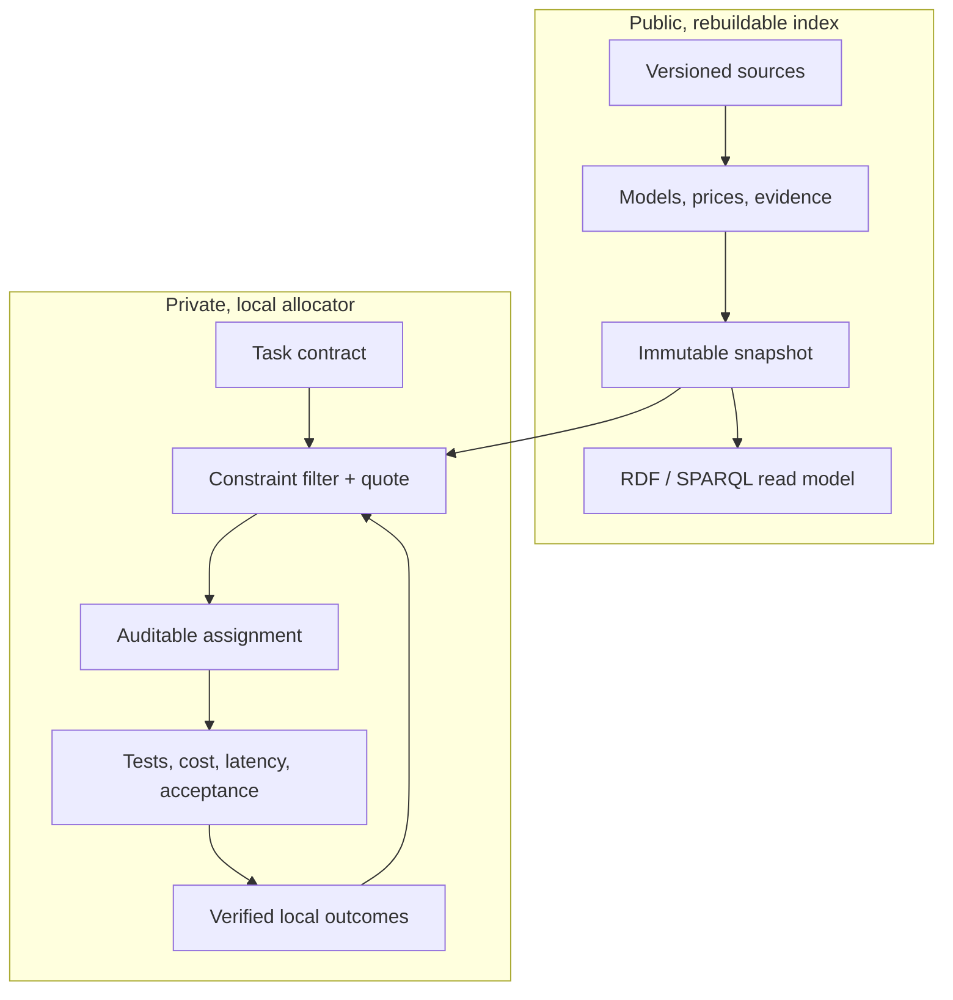

# Open Workforce Index

Open Workforce Index (OWI) is a local-first, provider-neutral system for using
AI models as a measured workforce. It selects the lowest expected-cost worker
that can satisfy a task's quality, latency, privacy, tool, and budget
requirements—and explains the evidence behind that choice.

The project is not a universal model leaderboard. Public benchmarks provide a
weak starting prior. Verified results from your own tasks and repositories
become the stronger, private signal.

> **Status:** architecture and executable v0.1 vertical slice. No provider keys
> or autonomous repository writes are needed yet.

## Why OWI

A top model is often wasted on a simple task, while a cheap model can become
expensive after retries and review. OWI optimizes **accepted-result cost**, not
the sticker price of one request:

```text
run cost + verification + quota shadow cost
         + P(failure) × (retry/escalation cost + failure penalty)
```

A worker is more precise than a model name:

```text
exact model release + provider offering + reasoning configuration
+ agent harness + system prompt/skill pack + tools + permissions
```

Changing any part creates a new worker identity and a new evidence trail.

## Architecture



The trust boundary is physical, not a UI flag:

- `index.sqlite` contains public catalog facts, evidence, prices, and immutable
  snapshots. It is rebuildable from reviewable source records.
- `local.sqlite` contains task decisions and personal outcomes. It defaults to
  owner-only file permissions and is never read by public export code.
- Oxigraph provides an in-memory RDF/SPARQL projection for ontology queries.
  SQLite and versioned source records remain authoritative, avoiding dual
  writes.

See [Architecture](docs/ARCHITECTURE.md) and the
[architecture decisions](docs/adr/) for the invariants.

## Workspace

| Crate | Responsibility |
|---|---|
| `workforce-domain` | Provider-neutral types and invariants |
| `workforce-engine` | Confidence estimates, eligibility, ranking, Pareto set, explanations |
| `workforce-store` | Physically separate public and private SQLite ledgers |
| `workforce-kg` | Public-only RDF projection and ontology syntax gate |
| `workforce-cli` | Small executable proof of the full decision loop |

The ontology uses SKOS for capabilities and PROV-O for evidence lineage. SHACL
defines ingestion and public-export contracts in [`ontology/`](ontology/).

## Quick start

Prerequisites: Rust 1.87 or newer.

```bash
cargo test --workspace
cargo run -p workforce-cli -- ontology validate
cargo run -p workforce-cli -- database init
cargo run -p workforce-cli -- quote --input examples/quote-request.json
cargo run -p workforce-cli -- learn --input examples/learning-request.json
```

The quote output lists both eligible and rejected workers, the hard constraint
behind every rejection, confidence bounds, expected accepted-result cost, the
Pareto frontier, and why the winner was selected.

## Selection policy

OWI makes safety and cost separate stages:

1. Validate the task contract.
2. Hard-filter privacy, context, tools, providers, availability, latency, and
   budget.
3. Require a conservative success-probability lower bound.
4. Among candidates that pass, minimize expected accepted-result cost.
5. Keep an independent maker/checker identity for consequential work.
6. Explore alternatives only for reversible, low-risk tasks with a capped
   exploration budget.

If no worker clears the quality floor, OWI returns the conflict. It does not
silently lower the requested quality to meet a budget.

## Updating for newly released models

Weekly discovery is an ingestion workflow, not a self-rewriting LLM:

```text
discovered → smoke-tested → benchmarked → eligible → locally calibrated
```

Model releases, prices, aliases, benchmarks, and raw observations are
append-only or time-bounded revisions. Each rebuild produces a new immutable
snapshot; last week's result is still reproducible. Public observations seed
low-strength priors, while private verified outcomes update immediately and
never leave the user's machine.

See the [roadmap](docs/ROADMAP.md) for automatic source adapters, signed index
snapshots, model execution, repository sandboxes, and a simple dashboard.

## Contributing

OWI is licensed under Apache-2.0. Benchmark datasets may have their own licenses
and are never implicitly relicensed by this repository. Read
[CONTRIBUTING.md](CONTRIBUTING.md) and [SECURITY.md](SECURITY.md) before adding a
source or execution adapter.
