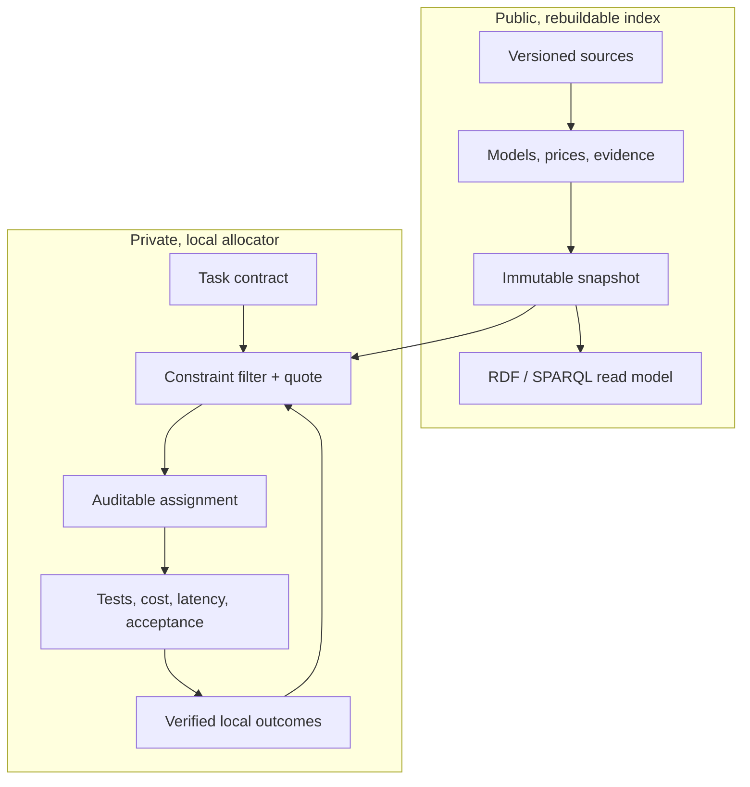

# Open Workforce Index

Open Workforce Index (OWI) is a local-first, provider-neutral system for using
AI models as a measured workforce. It selects the lowest expected-cost worker
that can satisfy a task's quality, latency, privacy, tool, and budget
requirements—and explains the evidence behind that choice.

The project is not a universal model leaderboard. Public benchmarks provide a
weak starting prior. Verified results from your own tasks and repositories
become the stronger, private signal.

> **Status:** v0.1 decision kernel and storage foundation. The CLI demonstrates
> quoting and evidence updates from fixtures; source ingestion, persisted
> end-to-end decisions, provider execution, and repository writes are planned.

## Why OWI

A top model is often wasted on a simple task, while a cheap model can become
expensive after retries and review. OWI optimizes **accepted-result cost**, not
the sticker price of one request:

```text
run cost + verification + quota shadow cost
         + P(failure) × (retry/escalation cost + failure penalty)
```

A worker is more precise than a model name:

```text
exact model release + provider offering + reasoning configuration
+ agent harness + system prompt/skill pack + tools + permissions
```

Changing any part creates a new worker identity and a new evidence trail.

The knowledge graph works like a football scouting system. The ontology defines
the position—application domain, task class, artifact, required skills/tools,
and acceptance profile—while evidence describes how each exact worker performs
in that position. A plan can assign different workers to different atomic
tasks, then optimize cost only among workers qualified for each one.

## Architecture



The trust boundary is physical, not a UI flag:

- `index.sqlite` contains public catalog facts, evidence, prices, and immutable
  snapshots. It is rebuildable from reviewable source records.
- `local.sqlite` contains task decisions and personal outcomes. It defaults to
  owner-only file permissions and is never read by public export code.
- Oxigraph provides an isolated, in-memory RDF/SPARQL surface. The typed public
  snapshot projection is a v0.2 release gate; SQLite and versioned source
  records remain authoritative, avoiding dual writes.

See [Architecture](docs/ARCHITECTURE.md) and the
[architecture decisions](docs/adr/) for the invariants.

## Workspace

| Crate | Responsibility |
|---|---|
| `workforce-domain` | Provider-neutral types and invariants |
| `workforce-engine` | Confidence estimates, eligibility, ranking, Pareto set, explanations |
| `workforce-store` | Physically separate public and private SQLite ledgers |
| `workforce-kg` | Public-only graph boundary and ontology syntax gate |
| `workforce-cli` | Executable demonstration of the decision kernel |

The ontology uses SKOS for capabilities and PROV-O for evidence lineage. SHACL
declares ingestion and public-export contracts in [`ontology/`](ontology/).
The v0.1 CLI validates RDF syntax; executing SHACL over a typed snapshot
projection is deliberately tracked as v0.2 work and is not claimed yet.
The generalized application/task/artifact capability tuples and portable
evidence-tracing eligibility query are also forward contracts for that v0.2
projection; the current Rust DTOs still route on declared skills and tools.

## Quick start

Prerequisites: Rust 1.87 or newer.

```bash
cargo test --workspace
cargo run -p workforce-cli -- ontology validate
cargo run -p workforce-cli -- database init
cargo run -p workforce-cli -- quote --input examples/quote-request.json
cargo run -p workforce-cli -- quote --input examples/cad-quote-request.json
cargo run -p workforce-cli -- learn --input examples/learning-request.json
```

The quote output lists both eligible and rejected workers, the hard constraint
behind every rejection, confidence bounds, expected accepted-result cost, the
Pareto frontier, and why the winner was selected.

CAD is only one fixture for the general rule. It demonstrates
application-aware routing by rejecting a cheap, strong conversation worker that
lacks the required CAD skills and toolchain, then comparing two exact CAD
worker configurations by expected accepted-result cost. The same primitives
extend to coding, research, law, images, simulation, translation, support, and
new application domains without building a separate global leaderboard for
each one.

This follows the same lesson reported by
[AA-Omniscience](https://arxiv.org/abs/2511.13029): model reliability varies by
domain and overall rankings hide important differences. OWI goes one step
further by refusing to transfer domain knowledge evidence into an unmeasured
artifact skill—for example, legal factuality is not CAD generation ability.
The person chooses the optimization policy and limits; OWI recommends the
eligible worker and explains the trade-off.

## Browser advisor (planned)

A planned Chrome Manifest V3 client will put OWI in a side panel and an explicit
“recommend selected text” context-menu action. It will offer three modes:

- `recommend` classifies the requested work product into a reviewable task
  contract, then explains the best configured workers, better alternatives that
  require setup, and excluded workers;
- `run` executes only an explicitly approved direct-API or local worker under a
  maximum-spend lease and hard task/project/provider caps; and
- `project` shows private Git-project usage, cost, environmental coverage, and
  the separately labeled counterfactual optimization estimate.

Application fit comes before ranking. The same page can produce a conversation
task or a CAD task depending on the requested artifact and acceptance checks;
the browser brand or website does not decide the model. Detection confidence,
adapter version, required skills/tools, and exclusions remain visible and
correctable.

The extension will be a thin client of the local Rust service, preferably over
Native Messaging. It will not request access to all sites by default, extract
consumer AI sessions, or keep provider credentials. Page or selected-text
context is shared only after an explicit preview. Provider websites use a
copy/deep-link/manual-import path; automatic `run` uses an official API or local
adapter with credentials held locally.

For a direct run, the panel will show a pre-run quote and approval, a live
planner/maker/checker/retry/tool timeline, streamed output or local artifact
references, and an actual-versus-estimated receipt by model and project. OWI
will never auto-buy credits or top up an account. Raw prompt/output display,
local persistence, redaction, and export are separate consent choices. Chrome
is the first target; Edge and Brave packages follow compatibility testing.
The client and all advisor/run/project interfaces are planned and are not part
of v0.1. See [ADR 0008](docs/adr/0008-browser-advisor-and-execution-boundary.md).

## Project cost reporting (planned v0.2)

OWI will attribute model calls, retries, independent checks, paid tools, and
explicit subscription shares to private Git project IDs. Each report will be
derived from one append-only usage ledger and will include a zero-difference
reconciliation check. Unknown historical attribution stays visible instead of
being guessed.

The intended local commands are shown below; they are design targets and are
not implemented in v0.1:

```bash
# Planned v0.2 commands
owi project register --repo . --name open-workforce-index
owi usage ingest --adapter generic-json --input usage.json
owi report project --project-id PROJECT_ID --from 2026-08-01 --to 2026-09-01
owi report reconcile
owi report savings --project-id PROJECT_ID --baseline-policy POLICY_ID
```

Spend and resource usage will be broken down by exact worker/model, task,
provider, and attempt role. Subscription attribution will be separate from
direct cash. Optimization benefit will be labeled a counterfactual estimate
with its baseline and coverage—not reported as cash that was definitely saved.

The same report contract keeps energy, location-based and market-based CO2e,
water consumption, and water withdrawal separate. Every estimate carries a
measurement boundary, source, date, uncertainty or quality grade, and coverage.
Missing provider data is `unknown`, never zero, and provider-wide figures are
not silently assigned to a specific model. See the illustrative
[`project-report.json`](examples/project-report.json) and
[ADR 0007](docs/adr/0007-environmental-impact-accounting.md).

## Selection policy

OWI makes safety and cost separate stages:

1. Validate the task contract.
2. Hard-filter privacy, context, tools, providers, availability, latency, and
   budget.
3. Require a conservative success-probability lower bound.
4. Among candidates that pass, minimize expected accepted-result cost.
5. Reserve a distinct policy-authorized checker identity for high-risk work and
   require a human approval gate for consequential work.
6. In the learned-allocation phase, explore alternatives only for reversible,
   low-risk tasks with a capped exploration budget.

If no worker clears the quality floor, OWI returns the conflict. It does not
silently lower the requested quality to meet a budget.

In v0.1 the checker is only an authorized distinct ID with a caller-supplied
review-cost assumption. Full checker availability, clearance, review skill,
evidence, context, and tariff validation—and all provider execution—remain
disabled until the planned v0.2 checker candidate plan is implemented.

## Updating for newly released models

Weekly discovery is an ingestion workflow, not a self-rewriting LLM:

```text
discovered → smoke-tested → benchmarked → eligible → locally calibrated
```

Model releases, prices, aliases, benchmarks, and raw observations are
append-only or time-bounded revisions. Each rebuild produces a new immutable
snapshot; last week's result is still reproducible. Public observations seed
low-strength priors, while private verified outcomes update immediately and
never leave the user's machine.

See the [roadmap](docs/ROADMAP.md) for automatic source adapters, signed index
snapshots, model execution, repository sandboxes, and a simple dashboard.

## Contributing

OWI is licensed under Apache-2.0. Benchmark datasets may have their own licenses
and are never implicitly relicensed by this repository. Read
[CONTRIBUTING.md](CONTRIBUTING.md) and [SECURITY.md](SECURITY.md) before adding a
source or execution adapter.
