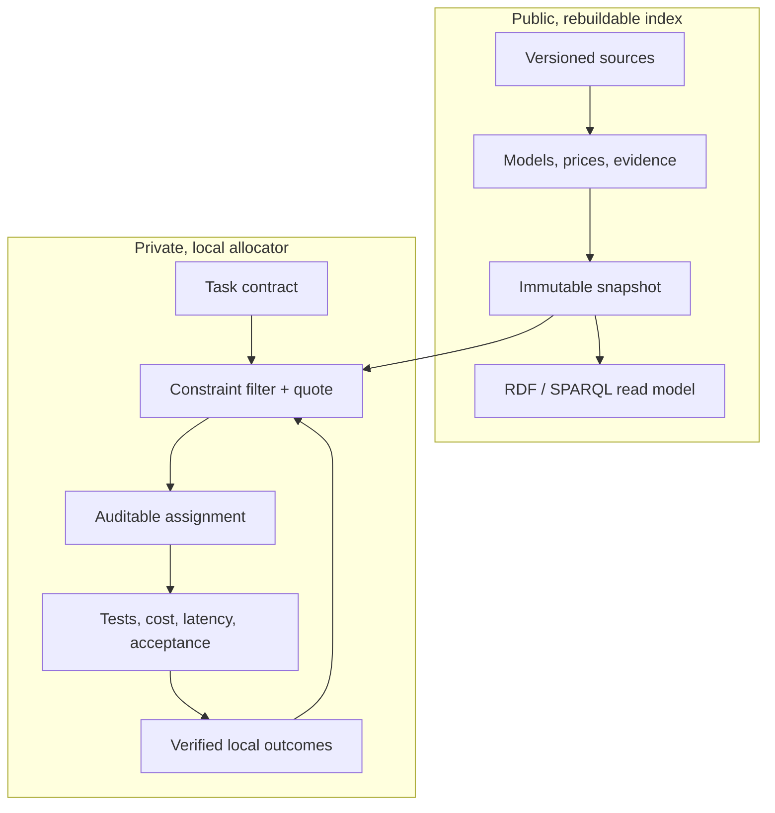

# Open Workforce Index

**An AI routing add-on for the tools you already use.**

Keep working in your browser editor, connected AI tool or Telegram. OWI can
receive a delegated task, choose a configured model, run it, check supported
requirements, and return the result to the same conversation.

[Use OWI online](docs/HOSTED.md) ·
[How routing works](docs/WORKFLOW.md) ·
[Optional browser example](demo/index.html)

## Connect once, then keep working

OWI's primary experience is a **hosted connection**: stay in your browser
editor, compatible AI chat, or Telegram. Users install nothing. The operator
runs the engine once on a server; connected tools send it delegated tasks and
receive the answers in the same conversation.

The [hosted implementation](docs/HOSTED.md) provides authenticated remote MCP,
an HTTP API, a browser connection screen and a Telegram webhook adapter.
Accounts have separate provider keys, private histories and task allowances.
**Private-pilot status:** it still needs an operator deployment and bot/account
configuration before a public URL or Telegram bot can be announced.

An existing website or third-party bot must support a connection or add an
integration. OWI cannot intercept every chat or replace all Copilot requests.
The current hosted pilot uses Bearer keys; web products requiring OAuth need
an additional OAuth adapter. OpenRouter usage has separate API billing.

Normal tool calls use the included engine, one worker attempt and local
checks, with no OWI page or acceptance prompt. Starting ability estimates are
assumptions; measured savings and general speedups remain unproven.

Prefer local operation? The optional [desktop download](docs/DESKTOP.md)
includes its engine and runtime, so Rust/Python installation is unnecessary.
Developers can also use the [source commands](docs/INTEGRATIONS.md#connect-from-source-developers).

## What works today

- An MCP tool for automatic task routing inside existing agents.
- A hosted API and Telegram adapter for a pilot without end-user downloads.
- An optional GUI to compare models and review results.
- Connected execution through your own configured model commands.
- Deterministic result checks and private outcome feedback.
- Subscription-aware routing and reported usage, with manual allowance refresh.
- Versioned working reminders, trial checks, pause and rollback.

**Early release:** starting ability estimates are assumptions. General quality
improvement and cost savings are not yet established by a model benchmark.
Instruction updates do not retrain model weights. See the
[24-task benchmark protocol](benchmarks/launch/README.md) and
[current limitations](docs/GETTING_STARTED.md).

## Optional local review

For local review and settings, use the optional [desktop package](docs/DESKTOP.md).
Source contributors can follow the [developer setup](docs/ROUTER.md).
Choosing a model does not execute it; **Run task** may consume provider credits
or subscription allowance.

[Usage and plans](docs/USAGE_AND_PLANS.md) ·
[Agent instruction updates](docs/ADAPTIVE_AGENTS.md) ·
[Complete workflow](docs/WORKFLOW.md) · [Early-user launch kit](docs/promotion/README.md)

## Help shape the project

Try one non-sensitive task you actually need to do, and tell us where you got
stuck. Successful first tasks and repeat use matter more than stars.
[First-task feedback](https://github.com/Morshedvarzandeh/Open-Workforce-Index/issues/new?template=first-task.yml)
is public; remove private data and credentials before submitting.

## Why OWI

A top model is often wasted on a simple task, while a cheap model can become
expensive after retries and review. OWI optimizes **accepted-result cost**, not
the sticker price of one request:

```text
run cost + verification + quota shadow cost
         + P(failure) × (retry/escalation cost + failure penalty)
```

A worker is more precise than a model name:

```text
exact model release + provider offering + reasoning configuration
+ agent harness + system prompt/skill pack + tools + permissions
```

Changing any part creates a new worker identity and a new evidence trail.

The knowledge graph works like a football scouting system. The ontology defines
the position—application domain, task class, artifact, required skills/tools,
and acceptance profile—while evidence describes how each exact worker performs
in that position. A plan can assign different workers to different atomic
tasks, then optimize cost only among workers qualified for each one.

## Architecture



The trust boundary is physical, not a UI flag:

- `index.sqlite` contains public catalog facts, evidence, prices, and immutable
  snapshots. It is rebuildable from reviewable source records.
- `local.sqlite` contains task decisions and personal outcomes. It defaults to
  owner-only file permissions and is never read by public export code.
- Oxigraph provides an isolated, in-memory RDF/SPARQL surface. The typed public
  snapshot projection is a v0.2 release gate; SQLite and versioned source
  records remain authoritative, avoiding dual writes.

See [Architecture](docs/ARCHITECTURE.md) and the
[architecture decisions](docs/adr/) for the invariants.

## Workspace

| Crate | Responsibility |
|---|---|
| `workforce-domain` | Provider-neutral types and invariants |
| `workforce-engine` | Confidence estimates, eligibility, ranking, Pareto set, explanations |
| `workforce-store` | Physically separate public and private SQLite ledgers |
| `workforce-sources` | Versioned import adapters for published prices and capabilities |
| `workforce-allocator` | Calibrates stored evidence into candidates and records decisions back |
| `workforce-kg` | Public-only graph boundary and ontology syntax gate |
| `workforce-cli` | Executable demonstration of the decision kernel |

The ontology uses SKOS for capabilities and PROV-O for evidence lineage. SHACL
declares ingestion and public-export contracts in [`ontology/`](ontology/).
The v0.1 CLI validates RDF syntax; executing SHACL over a typed snapshot
projection is deliberately tracked as v0.2 work and is not claimed yet.
The generalized application/task/artifact capability tuples and portable
evidence-tracing eligibility query are also forward contracts for that v0.2
projection; the current Rust DTOs still route on declared skills and tools.

## Developer quick start

Prerequisites: Rust 1.87 or newer.

```bash
cargo test --workspace
cargo run -p workforce-cli -- ontology validate
cargo run -p workforce-cli -- quote --input examples/quote-request.json
cargo run -p workforce-cli -- quote --input examples/cad-quote-request.json
```

The quote output lists both eligible and rejected workers, the hard constraint
behind every rejection, confidence bounds, expected accepted-result cost, the
Pareto frontier, and why the winner was selected.

`quote` takes candidate estimates as input, which is useful for exercising the
engine in isolation but means the caller supplies the success probabilities the
engine is supposed to be reasoning about. `allocate` derives them instead:

```bash
owi seed     --index .data/index.sqlite --input examples/index-seed.json
owi allocate --index .data/index.sqlite --local .data/local.sqlite \
             --input examples/allocation-request.json --record
owi outcome  --local .data/local.sqlite --input examples/outcome-rejected.json
owi allocate --index .data/index.sqlite --local .data/local.sqlite \
             --input examples/allocation-request.json
```

`examples/allocation-request.json` contains no success probabilities, no
confidence bounds, and no per-worker abilities. Those come from the seeded
evidence and the private outcome history. What the request does carry is named
explicitly as `assumptions`: retry cost, latency, and tool spend describe your
workflow, not the worker.

### The loop, and why it matters

Run the sequence above and the selected worker changes. With only public
evidence, the cheap worker wins:

```text
#1 worker:compact-agent-v1   mean=0.540  run=9000   retry=69000  total=78000
#2 worker:balanced-agent-v1  mean=0.820  run=72000  retry=27001  total=99001
```

After six verified local failures on the cheap worker, it loses:

```text
#1 worker:balanced-agent-v1  mean=0.820  run=72000  retry=27001  total=99001
#2 worker:compact-agent-v1   mean=0.338  run=9000   retry=99375  total=108375
```

The cheap worker never stopped being eight times cheaper per run. It stopped
being cheaper per *accepted result*, and only local evidence could show that.
Note also that the chat worker's 0.97 conversation score contributes nothing to
its debugging estimate — it stays at the bare `Beta(1, 1)` prior, because that
evidence measured a different skill.

CI asserts this flip on every push, so the loop cannot silently rot.

### Real token prices

Prices are the half of the comparison that *is* publicly available, so the
index imports them rather than inventing them:

```bash
curl -sSL -o litellm-prices.json \
  https://raw.githubusercontent.com/BerriAI/litellm/main/model_prices_and_context_window.json
owi prices --index .data/index.sqlite \
           --input litellm-prices.json \
           --options examples/price-import-options.json
```

Fetching is a separate step on purpose: the adapter hashes the exact bytes it
read and stamps that digest onto every record, so an import can be re-verified
against an archived payload. `--dry-run` prints the derived records without
writing.

The adapter converts per-token costs to integer micros per million tokens
(`$5.00/Mtok` → `5_000_000`, exactly — CI asserts this), and refuses anything
it cannot justify. Entries with no price, no context window, a negative cost,
or the wrong mode are reported as `skipped` with a reason rather than dropped.
LiteLLM's file carries no release dates, so `released_at` is written as
`unknown` — never backfilled with the retrieval date.

Routing five real workers on a 20k-in/4k-out task, with no ability evidence
and the quality floor explicitly lowered to accept unmeasured workers:

```text
 # worker              in $/Mtok  out $/Mtok    run $   total $
 1 gpt-5-mini-agent         0.25        2.00   0.0130    0.0880
 2 haiku-4-5-agent          1.00        5.00   0.0400    0.1150
 3 gpt-5-agent              1.25       10.00   0.0650    0.1400
 4 sonnet-4-5-agent         3.00       15.00   0.1200    0.1950
 5 opus-4-5-agent           5.00       25.00   0.2000    0.2750
```

Run cost spans **15×**; expected accepted cost spans **3.1×**. Sticker price
stops being the whole story as soon as retries are priced in, and that gap is
the entire thesis — but note it is currently driven by a *shared prior*, not by
measured differences between these models.

Restore a real quality floor and every one of them is rejected:

```text
worker:opus-4-5-agent -> skill_confidence_below_minimum (0.05 < 0.10)
```

That is the system working. With no applicable evidence the bound is
`Beta(1, 1)`'s 5th percentile, and OWI declines to pick rather than pretending
the price table tells it which model is better. Prices alone can rank cost;
they cannot rank *value*. Producing the missing half is what v0.2 is for.

CAD is only one fixture for the general rule. It demonstrates
application-aware routing by rejecting a cheap, strong conversation worker that
lacks the required CAD skills and toolchain, then comparing two exact CAD
worker configurations by expected accepted-result cost. The same primitives
extend to coding, research, law, images, simulation, translation, support, and
new application domains without building a separate global leaderboard for
each one.

This follows the same lesson reported by
[AA-Omniscience](https://arxiv.org/abs/2511.13029): model reliability varies by
domain and overall rankings hide important differences. OWI goes one step
further by refusing to transfer domain knowledge evidence into an unmeasured
artifact skill—for example, legal factuality is not CAD generation ability.
The person chooses the optimization policy and limits; OWI recommends the
eligible worker and explains the trade-off.

## Deferred designs

Three designed-but-unbuilt products live in [`docs/future/`](docs/future/): a
browser advisor, private Git-project cost accounting, and environmental impact
accounting. They were moved out of the ADR directory because an ADR is a
commitment, and none of them changes whether the routing thesis is true.

They come back when the thing they account for exists. See
[`docs/future/README.md`](docs/future/README.md) for the invariants worth
keeping in the meantime.

## Selection policy

OWI makes safety and cost separate stages:

1. Validate the task contract.
2. Hard-filter privacy, context, tools, providers, availability, latency, and
   budget.
3. Require a conservative success-probability lower bound.
4. Among candidates that pass, minimize expected accepted-result cost.
5. Reserve a distinct policy-authorized checker identity for high-risk work and
   require a human approval gate for consequential work.
6. In the learned-allocation phase, explore alternatives only for reversible,
   low-risk tasks with a capped exploration budget.

If no worker clears the quality floor, OWI returns the conflict. It does not
silently lower the requested quality to meet a budget.

In the Rust decision kernel, the checker is an authorized distinct ID with a caller-supplied
review-cost assumption. Full checker availability, clearance, review skill,
evidence, context, and tariff validation remain future work in that kernel.
The Python connected runtime already executes configured provider commands
and supports a separate checker; it does not establish those full checker
qualification guarantees.

## Updating for newly released models

Weekly discovery is an ingestion workflow, not a self-rewriting LLM:

```text
discovered → smoke-tested → benchmarked → eligible → locally calibrated
```

Model releases, prices, aliases, benchmarks, and raw observations are
append-only or time-bounded revisions. Each rebuild produces a new immutable
snapshot; last week's result is still reproducible. Public observations seed
low-strength priors, while private verified outcomes update immediately in
the account's private ledger. Hosted ledgers stay on the operator's server;
local installations keep them on the user's machine.

See the [roadmap](docs/ROADMAP.md) for automatic source adapters, signed index
snapshots, expanded execution support, and repository sandboxes. The simple
GUI and configured-command execution described above are available today.

## License

Copyright (C) 2026 Morshed Varzandeh.

Open Workforce Index is licensed under the **GNU Affero General Public License,
version 3 only** (`AGPL-3.0-only`). You may redistribute and modify it under
the terms in [LICENSE](LICENSE). It is provided without warranty, including
the implied warranties of merchantability and fitness for a particular purpose.

Commercial use is permitted. If you modify OWI and let users interact with that
version over a network, you must prominently offer those users its corresponding
source under AGPLv3, as required by section 13. Distributing copies also carries
the license's notice and source requirements.

This license applies to OWI code, documentation, ontology, and project-authored
data unless a separate license is explicitly stated. Dependencies and imported
benchmark material retain their own licenses. License values inside evidence
records and test fixtures describe the represented source material; they do not
set the license of the surrounding OWI software.

Earlier revisions published under Apache-2.0 remain available under those terms.
This change does not revoke permissions already granted for those revisions.

## Contributing

Read
[CONTRIBUTING.md](CONTRIBUTING.md) and [SECURITY.md](SECURITY.md) before adding a
source or execution adapter.
