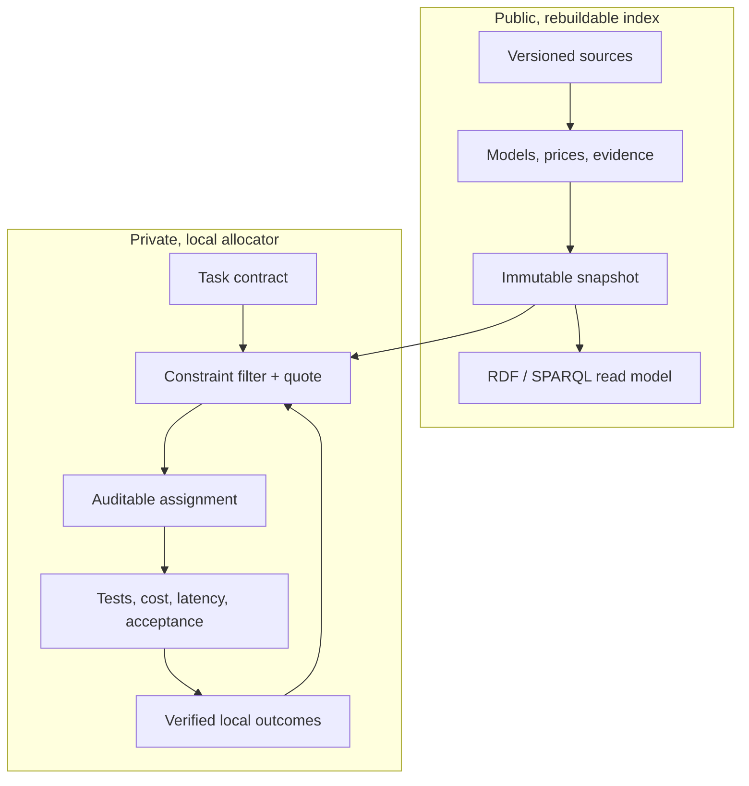

# Open Workforce Index

Open Workforce Index (OWI) is a local-first, provider-neutral system for using
AI models as a measured workforce. It selects the lowest expected-cost worker
that can satisfy a task's quality, latency, privacy, tool, and budget
requirements—and explains the evidence behind that choice.

The project is not a universal model leaderboard. Public benchmarks provide a
weak starting prior. Verified results from your own tasks and repositories
become the stronger, private signal.

> **Status:** v0.1 decision kernel, storage foundation, and a closed decision
> loop. `owi seed → allocate → outcome → allocate` derives candidates from
> stored evidence, records the decision, and lets verified local outcomes
> change the next one.
>
> **Prices are real; ability evidence is not.** `owi prices` imports published
> per-token prices and context windows with their source URL and a content
> digest. No benchmark measures these exact worker configurations on a given
> skill, so ability evidence remains the missing piece — and the allocator
> refuses to route without it rather than guessing. Provider execution and the
> benchmark runner are the v0.2 work.

## Quick start — one command

```bash
tools/owi-do "rewrite this email to the supplier"
```

It guesses the kind of work, picks the cheapest qualified model from real
published prices, shows the pick and two alternates, and records the decision.
First run bootstraps a private workspace automatically.

To actually execute, put your own CLI (your key, never ours) in
`.owi-quick/runners.json`, then:

```bash
tools/owi-do "rewrite this email to the supplier" --run
```

After the run it asks `accepted? [y/n]` — and that answer changes the next
pick. Reject a worker often enough and it stops being chosen. That is the
entire idea, in one command.

Prefer a page over a terminal? One more command serves the same experience at
a local link, with a run button and learning recorded to the real ledger:

```bash
tools/owi-serve        # open http://127.0.0.1:7787
```

The complete workflow, every level from this link to real measurement, is
written in [docs/WORKFLOW.md](docs/WORKFLOW.md).

### The quote, checked against the bill

A router that quotes prices and never reads a receipt is doing arithmetic,
not accounting. Point a runner at the wrapper and every run records what it
actually cost, beside the quote it is meant to check:

```json
"haiku-4-5": "tools/owi-claude-runner --model claude-haiku-4-5-20251001"
```

```
→ haiku-4-5/extract   $0.0091 per accepted result
  billed $0.0171 against a quote of $0.0091  (1.9x)
```

Measured over sixteen real calls the quote ran **2.3x low**, consistently. The
estimate of the *task* was close — 1,642 input and 380 output tokens actual
against 2,026 and 800 estimated. What was never modelled is the agent CLI's
own context: roughly 4,900 tokens written to cache and 27,000 read back on
every single call, billed at the chosen model's rate. The harness costs more
than the work does.

That does not change who wins. The overhead is per-call and scales with the
model's price, so a cheap worker wins by *more* than the quote claims — the
seven-module audit below cost $0.1294 routed to haiku against roughly five
times that on opus-5. It does mean every absolute figure was understated, and
that a run through some other CLI still reports nothing, which the ledger
records as unknown rather than as zero.

### Learning that outlives the machine

The private ledger is not in git, and should not be — it holds task text. But
that means the roster's accumulated evidence lives in exactly one place, and a
reclaimed container takes it with no error and no warning: the next decision
quietly falls back to the shipped assumptions while looking exactly like a
decision made on evidence.

```bash
tools/owi-ledger export --out learned.json    # redacted statistics
tools/owi-ledger restore --in learned.json    # into a fresh ledger
```

What leaves is who did what work, how often it was accepted, and whether a
rejection counted — never task text, failure detail or checklist contents.
Restoring rebuilds the posteriors exactly, and every restored record is marked
`self_reported` and `restored_from_summary` with the digest it came from, so a
number inherited from a machine that no longer exists can always be told apart
from one measured here. Re-benching replaces it with the real thing.

### Work that must not leave the machine

Confidentiality is a gate, not a preference. A task marked `--privacy
confidential` turns away every cloud worker whatever it costs, because a
worker reached over an API is cleared for metadata at best. That leaves only
models running on your own hardware — and if you have none, the honest answer
is that nobody qualifies.

Hire one in a single command:

```bash
tools/owi-hire-local hermes3 --context 131072 --developer "Nous Research"
```

That declares the model, cuts a snapshot containing it, points the front door
at that snapshot, and writes the runner so it is executable rather than merely
quotable. It is a *declaration*, not an import, and it says so: a local model
has no published price row to fetch, and its price is genuinely zero. Ability
is not declared — a hired model starts at the same discounted, unmeasured
prior as everyone else and earns its posterior from your verified outcomes.

Two things this changes, both measured rather than asserted:

**It staffs cases that had nobody.** A 21,000-token confidential document was
refused at any price — the only cleared worker on the roster had an 8,192-token
window, so every candidate was rejected with `context_window_too_small`. A
131,072-token local model takes it.

**Free is not automatically cheapest.** A local worker's cost is flat — the
tokens are yours — but it starts less trusted, and the allocator charges for
the retry that a lower confidence implies. So it loses on short work and wins
decisively on long:

| shape | winner | its cost | local Hermes |
|---|---|---|---|
| 500 in / 200 out | `haiku-4-5/text` | $0.0050 | #3 · $0.0072 |
| 1,500 / 800 | `gpt-5-nano/text` | $0.0066 | #2 · $0.0072 |
| 5,000 / 1,000 | `gpt-5-nano/text` | $0.0069 | #2 · $0.0072 |
| 20,000 / 1,000 | **`local-hermes3/text`** | **$0.0072** | #1 |
| 100,000 / 2,000 | **`local-hermes3/text`** | **$0.0072** | #1 |

The crossover sits near 10–20k input tokens. Below it, paying a cloud model to
be more likely right beats paying nothing to be less likely right.

The clearance gate covers the whole crew, not just the worker doing the job:
the judge reads the output, the checklist writer reads the task line, and the
planner under `--split` reads the entire input document. All three are filtered
by the same ladder. When nothing cleared is available the item is left
explicitly unchecked and says so — an unverified result is worse than a
verified one, and far better than a leak.

Everything below this line is the advanced layer: manifests that plan whole
projects from a file in git, consoles with live weighting dials, benchmark
harnesses, and total-cost-of-ownership scenarios. Start with `owi-do`; go
deeper only when you want to.

## Why OWI

A top model is often wasted on a simple task, while a cheap model can become
expensive after retries and review. OWI optimizes **accepted-result cost**, not
the sticker price of one request:

```text
run cost + verification + quota shadow cost
         + P(failure) × (retry/escalation cost + failure penalty)
```

A worker is more precise than a model name:

```text
exact model release + provider offering + reasoning configuration
+ agent harness + system prompt/skill pack + tools + permissions
```

Changing any part creates a new worker identity and a new evidence trail.

The knowledge graph works like a football scouting system. The ontology defines
the position—application domain, task class, artifact, required skills/tools,
and acceptance profile—while evidence describes how each exact worker performs
in that position. A plan can assign different workers to different atomic
tasks, then optimize cost only among workers qualified for each one.

## Architecture



The trust boundary is physical, not a UI flag:

- `index.sqlite` contains public catalog facts, evidence, prices, and immutable
  snapshots. It is rebuildable from reviewable source records.
- `local.sqlite` contains task decisions and personal outcomes. It defaults to
  owner-only file permissions and is never read by public export code.
- Oxigraph provides an isolated, in-memory RDF/SPARQL surface. The typed public
  snapshot projection is a v0.2 release gate; SQLite and versioned source
  records remain authoritative, avoiding dual writes.

See [Architecture](docs/ARCHITECTURE.md) and the
[architecture decisions](docs/adr/) for the invariants.

## Workspace

| Crate | Responsibility |
|---|---|
| `workforce-domain` | Provider-neutral types and invariants |
| `workforce-engine` | Confidence estimates, eligibility, ranking, Pareto set, explanations |
| `workforce-store` | Physically separate public and private SQLite ledgers |
| `workforce-sources` | Versioned import adapters for published prices and capabilities |
| `workforce-allocator` | Calibrates stored evidence into candidates and records decisions back |
| `workforce-kg` | Public-only graph boundary and ontology syntax gate |
| `workforce-cli` | Executable demonstration of the decision kernel |

The ontology uses SKOS for capabilities and PROV-O for evidence lineage. SHACL
declares ingestion and public-export contracts in [`ontology/`](ontology/).
The v0.1 CLI validates RDF syntax; executing SHACL over a typed snapshot
projection is deliberately tracked as v0.2 work and is not claimed yet.
The generalized application/task/artifact capability tuples and portable
evidence-tracing eligibility query are also forward contracts for that v0.2
projection; the current Rust DTOs still route on declared skills and tools.

## Quick start

Prerequisites: Rust 1.87 or newer.

```bash
cargo test --workspace
cargo run -p workforce-cli -- ontology validate
cargo run -p workforce-cli -- quote --input examples/quote-request.json
cargo run -p workforce-cli -- quote --input examples/cad-quote-request.json
```

The quote output lists both eligible and rejected workers, the hard constraint
behind every rejection, confidence bounds, expected accepted-result cost, the
Pareto frontier, and why the winner was selected.

`quote` takes candidate estimates as input, which is useful for exercising the
engine in isolation but means the caller supplies the success probabilities the
engine is supposed to be reasoning about. `allocate` derives them instead:

```bash
owi seed     --index .data/index.sqlite --input examples/index-seed.json
owi allocate --index .data/index.sqlite --local .data/local.sqlite \
             --input examples/allocation-request.json --record
owi outcome  --local .data/local.sqlite --input examples/outcome-rejected.json
owi allocate --index .data/index.sqlite --local .data/local.sqlite \
             --input examples/allocation-request.json
```

`examples/allocation-request.json` contains no success probabilities, no
confidence bounds, and no per-worker abilities. Those come from the seeded
evidence and the private outcome history. What the request does carry is named
explicitly as `assumptions`: retry cost, latency, and tool spend describe your
workflow, not the worker.

### The loop, and why it matters

Run the sequence above and the selected worker changes. With only public
evidence, the cheap worker wins:

```text
#1 worker:compact-agent-v1   mean=0.540  run=9000   retry=69000  total=78000
#2 worker:balanced-agent-v1  mean=0.820  run=72000  retry=27001  total=99001
```

After six verified local failures on the cheap worker, it loses:

```text
#1 worker:balanced-agent-v1  mean=0.820  run=72000  retry=27001  total=99001
#2 worker:compact-agent-v1   mean=0.338  run=9000   retry=99375  total=108375
```

The cheap worker never stopped being eight times cheaper per run. It stopped
being cheaper per *accepted result*, and only local evidence could show that.
Note also that the chat worker's 0.97 conversation score contributes nothing to
its debugging estimate — it stays at the bare `Beta(1, 1)` prior, because that
evidence measured a different skill.

CI asserts this flip on every push, so the loop cannot silently rot.

### Real token prices

Prices are the half of the comparison that *is* publicly available, so the
index imports them rather than inventing them:

```bash
curl -sSL -o litellm-prices.json \
  https://raw.githubusercontent.com/BerriAI/litellm/main/model_prices_and_context_window.json
owi prices --index .data/index.sqlite \
           --input litellm-prices.json \
           --options examples/price-import-options.json
```

Fetching is a separate step on purpose: the adapter hashes the exact bytes it
read and stamps that digest onto every record, so an import can be re-verified
against an archived payload. `--dry-run` prints the derived records without
writing.

The adapter converts per-token costs to integer micros per million tokens
(`$5.00/Mtok` → `5_000_000`, exactly — CI asserts this), and refuses anything
it cannot justify. Entries with no price, no context window, a negative cost,
or the wrong mode are reported as `skipped` with a reason rather than dropped.
LiteLLM's file carries no release dates, so `released_at` is written as
`unknown` — never backfilled with the retrieval date.

Routing five real workers on a 20k-in/4k-out task, with no ability evidence
and the quality floor explicitly lowered to accept unmeasured workers:

```text
 # worker              in $/Mtok  out $/Mtok    run $   total $
 1 gpt-5-mini-agent         0.25        2.00   0.0130    0.0880
 2 haiku-4-5-agent          1.00        5.00   0.0400    0.1150
 3 gpt-5-agent              1.25       10.00   0.0650    0.1400
 4 sonnet-4-5-agent         3.00       15.00   0.1200    0.1950
 5 opus-4-5-agent           5.00       25.00   0.2000    0.2750
```

Run cost spans **15×**; expected accepted cost spans **3.1×**. Sticker price
stops being the whole story as soon as retries are priced in, and that gap is
the entire thesis — but note it is currently driven by a *shared prior*, not by
measured differences between these models.

Restore a real quality floor and every one of them is rejected:

```text
worker:opus-4-5-agent -> skill_confidence_below_minimum (0.05 < 0.10)
```

That is the system working. With no applicable evidence the bound is
`Beta(1, 1)`'s 5th percentile, and OWI declines to pick rather than pretending
the price table tells it which model is better. Prices alone can rank cost;
they cannot rank *value*. Producing the missing half is what v0.2 is for.

CAD is only one fixture for the general rule. It demonstrates
application-aware routing by rejecting a cheap, strong conversation worker that
lacks the required CAD skills and toolchain, then comparing two exact CAD
worker configurations by expected accepted-result cost. The same primitives
extend to coding, research, law, images, simulation, translation, support, and
new application domains without building a separate global leaderboard for
each one.

This follows the same lesson reported by
[AA-Omniscience](https://arxiv.org/abs/2511.13029): model reliability varies by
domain and overall rankings hide important differences. OWI goes one step
further by refusing to transfer domain knowledge evidence into an unmeasured
artifact skill—for example, legal factuality is not CAD generation ability.
The person chooses the optimization policy and limits; OWI recommends the
eligible worker and explains the trade-off.

## Deferred designs

Three designed-but-unbuilt products live in [`docs/future/`](docs/future/): a
browser advisor, private Git-project cost accounting, and environmental impact
accounting. They were moved out of the ADR directory because an ADR is a
commitment, and none of them changes whether the routing thesis is true.

They come back when the thing they account for exists. See
[`docs/future/README.md`](docs/future/README.md) for the invariants worth
keeping in the meantime.

## Selection policy

OWI makes safety and cost separate stages:

1. Validate the task contract.
2. Hard-filter privacy, context, tools, providers, availability, latency, and
   budget.
3. Require a conservative success-probability lower bound.
4. Among candidates that pass, minimize expected accepted-result cost.
5. Reserve a distinct policy-authorized checker identity for high-risk work and
   require a human approval gate for consequential work.
6. In the learned-allocation phase, explore alternatives only for reversible,
   low-risk tasks with a capped exploration budget.

If no worker clears the quality floor, OWI returns the conflict. It does not
silently lower the requested quality to meet a budget.

In v0.1 the checker is only an authorized distinct ID with a caller-supplied
review-cost assumption. Full checker availability, clearance, review skill,
evidence, context, and tariff validation—and all provider execution—remain
disabled until the planned v0.2 checker candidate plan is implemented.

## Updating for newly released models

Weekly discovery is an ingestion workflow, not a self-rewriting LLM:

```text
discovered → smoke-tested → benchmarked → eligible → locally calibrated
```

Model releases, prices, aliases, benchmarks, and raw observations are
append-only or time-bounded revisions. Each rebuild produces a new immutable
snapshot; last week's result is still reproducible. Public observations seed
low-strength priors, while private verified outcomes update immediately and
never leave the user's machine.

See the [roadmap](docs/ROADMAP.md) for automatic source adapters, signed index
snapshots, model execution, repository sandboxes, and a simple dashboard.

## Contributing

OWI is licensed under Apache-2.0. Benchmark datasets may have their own licenses
and are never implicitly relicensed by this repository. Read
[CONTRIBUTING.md](CONTRIBUTING.md) and [SECURITY.md](SECURITY.md) before adding a
source or execution adapter.
