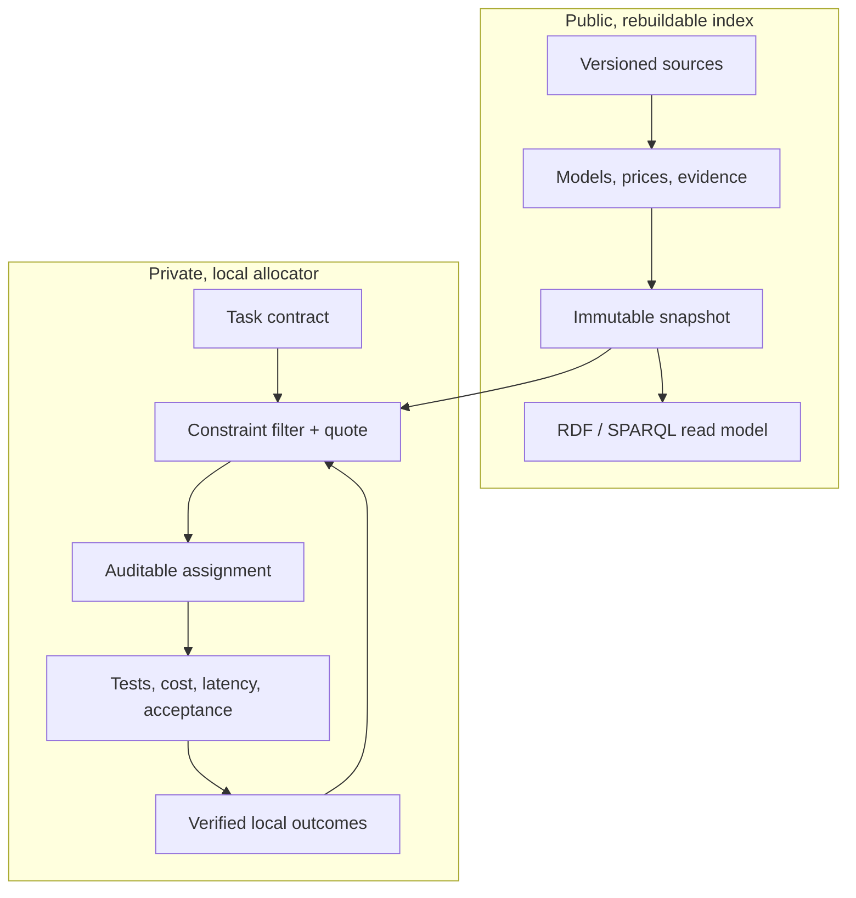

# Open Workforce Index

Open Workforce Index (OWI) is a local-first, provider-neutral system for using
AI models as a measured workforce. It selects the lowest expected-cost worker
that can satisfy a task's quality, latency, privacy, tool, and budget
requirements—and explains the evidence behind that choice.

The project is not a universal model leaderboard. Public benchmarks provide a
weak starting prior. Verified results from your own tasks and repositories
become the stronger, private signal.

> **Status:** v0.1 decision kernel, storage foundation, and a closed decision
> loop. `owi seed → allocate → outcome → allocate` derives candidates from
> stored evidence, records the decision, and lets verified local outcomes
> change the next one.
>
> **What is not here yet: real data.** Every price and benchmark score in
> `examples/` is a labelled placeholder. The project deliberately ships no
> number it has not verified. Provider execution, source ingestion adapters,
> and the benchmark runner that would produce real evidence are the v0.2 work,
> and until they exist OWI is a mechanism without a measurement.

## Why OWI

A top model is often wasted on a simple task, while a cheap model can become
expensive after retries and review. OWI optimizes **accepted-result cost**, not
the sticker price of one request:

```text
run cost + verification + quota shadow cost
         + P(failure) × (retry/escalation cost + failure penalty)
```

A worker is more precise than a model name:

```text
exact model release + provider offering + reasoning configuration
+ agent harness + system prompt/skill pack + tools + permissions
```

Changing any part creates a new worker identity and a new evidence trail.

The knowledge graph works like a football scouting system. The ontology defines
the position—application domain, task class, artifact, required skills/tools,
and acceptance profile—while evidence describes how each exact worker performs
in that position. A plan can assign different workers to different atomic
tasks, then optimize cost only among workers qualified for each one.

## Architecture



The trust boundary is physical, not a UI flag:

- `index.sqlite` contains public catalog facts, evidence, prices, and immutable
  snapshots. It is rebuildable from reviewable source records.
- `local.sqlite` contains task decisions and personal outcomes. It defaults to
  owner-only file permissions and is never read by public export code.
- Oxigraph provides an isolated, in-memory RDF/SPARQL surface. The typed public
  snapshot projection is a v0.2 release gate; SQLite and versioned source
  records remain authoritative, avoiding dual writes.

See [Architecture](docs/ARCHITECTURE.md) and the
[architecture decisions](docs/adr/) for the invariants.

## Workspace

| Crate | Responsibility |
|---|---|
| `workforce-domain` | Provider-neutral types and invariants |
| `workforce-engine` | Confidence estimates, eligibility, ranking, Pareto set, explanations |
| `workforce-store` | Physically separate public and private SQLite ledgers |
| `workforce-allocator` | Calibrates stored evidence into candidates and records decisions back |
| `workforce-kg` | Public-only graph boundary and ontology syntax gate |
| `workforce-cli` | Executable demonstration of the decision kernel |

The ontology uses SKOS for capabilities and PROV-O for evidence lineage. SHACL
declares ingestion and public-export contracts in [`ontology/`](ontology/).
The v0.1 CLI validates RDF syntax; executing SHACL over a typed snapshot
projection is deliberately tracked as v0.2 work and is not claimed yet.
The generalized application/task/artifact capability tuples and portable
evidence-tracing eligibility query are also forward contracts for that v0.2
projection; the current Rust DTOs still route on declared skills and tools.

## Quick start

Prerequisites: Rust 1.87 or newer.

```bash
cargo test --workspace
cargo run -p workforce-cli -- ontology validate
cargo run -p workforce-cli -- quote --input examples/quote-request.json
cargo run -p workforce-cli -- quote --input examples/cad-quote-request.json
```

The quote output lists both eligible and rejected workers, the hard constraint
behind every rejection, confidence bounds, expected accepted-result cost, the
Pareto frontier, and why the winner was selected.

`quote` takes candidate estimates as input, which is useful for exercising the
engine in isolation but means the caller supplies the success probabilities the
engine is supposed to be reasoning about. `allocate` derives them instead:

```bash
owi seed     --index .data/index.sqlite --input examples/index-seed.json
owi allocate --index .data/index.sqlite --local .data/local.sqlite \
             --input examples/allocation-request.json --record
owi outcome  --local .data/local.sqlite --input examples/outcome-rejected.json
owi allocate --index .data/index.sqlite --local .data/local.sqlite \
             --input examples/allocation-request.json
```

`examples/allocation-request.json` contains no success probabilities, no
confidence bounds, and no per-worker abilities. Those come from the seeded
evidence and the private outcome history. What the request does carry is named
explicitly as `assumptions`: retry cost, latency, and tool spend describe your
workflow, not the worker.

### The loop, and why it matters

Run the sequence above and the selected worker changes. With only public
evidence, the cheap worker wins:

```text
#1 worker:compact-agent-v1   mean=0.540  run=9000   retry=69000  total=78000
#2 worker:balanced-agent-v1  mean=0.820  run=72000  retry=27001  total=99001
```

After six verified local failures on the cheap worker, it loses:

```text
#1 worker:balanced-agent-v1  mean=0.820  run=72000  retry=27001  total=99001
#2 worker:compact-agent-v1   mean=0.338  run=9000   retry=99375  total=108375
```

The cheap worker never stopped being eight times cheaper per run. It stopped
being cheaper per *accepted result*, and only local evidence could show that.
Note also that the chat worker's 0.97 conversation score contributes nothing to
its debugging estimate — it stays at the bare `Beta(1, 1)` prior, because that
evidence measured a different skill.

CI asserts this flip on every push, so the loop cannot silently rot.

CAD is only one fixture for the general rule. It demonstrates
application-aware routing by rejecting a cheap, strong conversation worker that
lacks the required CAD skills and toolchain, then comparing two exact CAD
worker configurations by expected accepted-result cost. The same primitives
extend to coding, research, law, images, simulation, translation, support, and
new application domains without building a separate global leaderboard for
each one.

This follows the same lesson reported by
[AA-Omniscience](https://arxiv.org/abs/2511.13029): model reliability varies by
domain and overall rankings hide important differences. OWI goes one step
further by refusing to transfer domain knowledge evidence into an unmeasured
artifact skill—for example, legal factuality is not CAD generation ability.
The person chooses the optimization policy and limits; OWI recommends the
eligible worker and explains the trade-off.

## Deferred designs

Three designed-but-unbuilt products live in [`docs/future/`](docs/future/): a
browser advisor, private Git-project cost accounting, and environmental impact
accounting. They were moved out of the ADR directory because an ADR is a
commitment, and none of them changes whether the routing thesis is true.

They come back when the thing they account for exists. See
[`docs/future/README.md`](docs/future/README.md) for the invariants worth
keeping in the meantime.

## Selection policy

OWI makes safety and cost separate stages:

1. Validate the task contract.
2. Hard-filter privacy, context, tools, providers, availability, latency, and
   budget.
3. Require a conservative success-probability lower bound.
4. Among candidates that pass, minimize expected accepted-result cost.
5. Reserve a distinct policy-authorized checker identity for high-risk work and
   require a human approval gate for consequential work.
6. In the learned-allocation phase, explore alternatives only for reversible,
   low-risk tasks with a capped exploration budget.

If no worker clears the quality floor, OWI returns the conflict. It does not
silently lower the requested quality to meet a budget.

In v0.1 the checker is only an authorized distinct ID with a caller-supplied
review-cost assumption. Full checker availability, clearance, review skill,
evidence, context, and tariff validation—and all provider execution—remain
disabled until the planned v0.2 checker candidate plan is implemented.

## Updating for newly released models

Weekly discovery is an ingestion workflow, not a self-rewriting LLM:

```text
discovered → smoke-tested → benchmarked → eligible → locally calibrated
```

Model releases, prices, aliases, benchmarks, and raw observations are
append-only or time-bounded revisions. Each rebuild produces a new immutable
snapshot; last week's result is still reproducible. Public observations seed
low-strength priors, while private verified outcomes update immediately and
never leave the user's machine.

See the [roadmap](docs/ROADMAP.md) for automatic source adapters, signed index
snapshots, model execution, repository sandboxes, and a simple dashboard.

## Contributing

OWI is licensed under Apache-2.0. Benchmark datasets may have their own licenses
and are never implicitly relicensed by this repository. Read
[CONTRIBUTING.md](CONTRIBUTING.md) and [SECURITY.md](SECURITY.md) before adding a
source or execution adapter.
