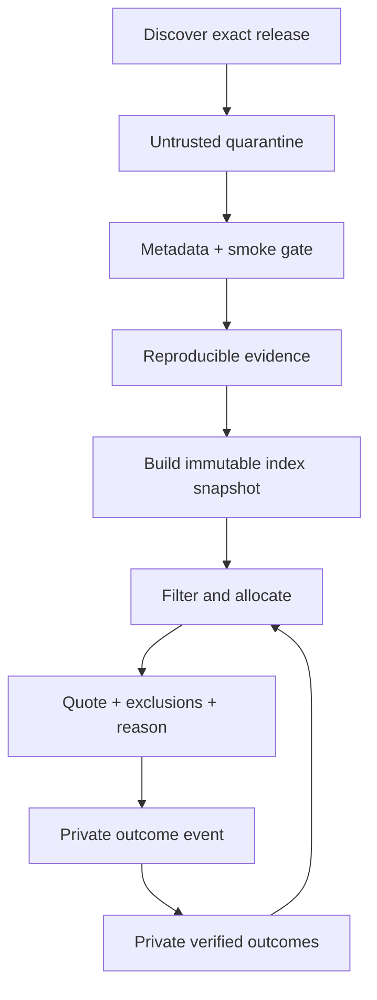

# Architecture

## Product boundary

OWI has two products that share schemas but not trust:

1. **Open Workforce Index** — public identities, offerings, prices, benchmark
   definitions, reproducible observations, provenance, and snapshots.
2. **Local Workforce Allocator** — private tasks, repository scopes, budgets,
   quotes, assignments, usage, verification, and outcomes.

One Rust executable can host both in v0.1. The database files, interfaces, and
export paths remain separate so they can later be deployed independently.

## System roles

| Role | May do | Must not do |
|---|---|---|
| Planner | Produce a typed task DAG with skills, risk, and acceptance criteria | Name models, grant tools, or authorize spend |
| Policy validator | Check DAG, privacy, permissions, overlap, and approval requirements | Use model persuasion as authority |
| Staffing engine | Map valid task requirements to eligible worker identities | Override hard constraints |
| Finance controller | Reserve and settle bounded cash/quota/time leases | Convert subscriptions to “free” without a user shadow price |
| Execution runtime | Run an assigned worker inside its lease | Expand repository, network, secret, or delegation scope |
| Verifier | Run deterministic checks and independent review | Let the same worker identity approve critical output |

The planner therefore never controls the three high-impact decisions: worker
identity, permission, or money.

## Data flow



Discovery metadata is not evidence of ability. Mutable provider aliases such as
`latest` resolve to an exact offering revision and never inherit the full
confidence of the previous target.

## Storage

### Version-controlled sources

Small curated facts and mappings live as reviewable JSON/Turtle plus import
code. Generated SQLite databases and large benchmark payloads are release
artifacts, not Git source. Each external record stores its URI, retrieval and
publication time, source/data license, content digest, protocol, and adapter
version.

### Public SQLite index

Append-only releases, evidence, and snapshots. Offerings, aliases, and prices
are time-bounded revisions. A snapshot records the input digest and estimator
version. It can be rebuilt and verified without the private database.

### Private SQLite ledger

Append-only decisions and outcomes, stored in a different file with owner-only
permissions. Raw prompts, credentials, repository contents, and secrets are not
part of public schemas. Secrets are never persisted by OWI.

### Knowledge graph

OWL/RDFS defines meaning, SKOS defines the evolving skill taxonomy, PROV-O
links evidence to sources, and SHACL declares ingestion/export constraints.
Oxigraph builds a disposable RDF read model from a public snapshot for SPARQL
and interoperability. There is no SQLite/RDF dual write.

## Estimation and routing

For worker \(w\) and task \(t\), the initial estimator maintains transparent
Beta evidence per skill and produces a mean and conservative lower confidence
bound (LCB). Public evidence has capped prior strength. Locally verified
success/failure outcomes dominate over time and can be scoped by repository and
task class.

Eligibility is lexicographic, not one unsafe weighted score:

1. Hard constraints: privacy, provider policy, context, modality/tools,
   permissions, availability, deadline, and budget dimensions.
2. Quality gate: \(LCB(P(pass\ on\ first\ attempt))\) meets the task threshold.
3. Objective: minimum expected accepted-result cost.

\[
C_{accepted} = C_{run} + C_{verify} + C_{quota-shadow}
+ (1 - P_{pass}) (C_{retry/escalate} + C_{failure})
\]

Cash uses integer micros. API cash, subscription quota, local GPU seconds,
tokens, and wall time remain separate budget dimensions unless the user defines
an explicit shadow price.

For a fixed task, policy, public snapshot, private state version, and seed, a
quote is deterministic. It records every exclusion and retains the Pareto set,
not merely the winner.

## Update lifecycle

Each ingestion is idempotent and content-addressed. New entries move through:

```text
discovered → smoke_tested → benchmarked → eligible
```

A source observation is immutable. Relevance can become stale, so an estimator
may widen uncertainty or discount its transfer weight; it never edits the old
measurement. Changes to a model, harness, prompt/skill pack, tools, policy, or
opaque alias target create a new identity or revision.

## Execution boundary (planned)

Read-only workers may share a checkout. Every writing worker receives an
isolated worktree/container and a narrow path/action lease. Network egress,
secrets, push, pull request, merge, deploy, deletion, and budget expansion are
separate policy gates. Repository and tool output are treated as untrusted data
to limit prompt injection.
