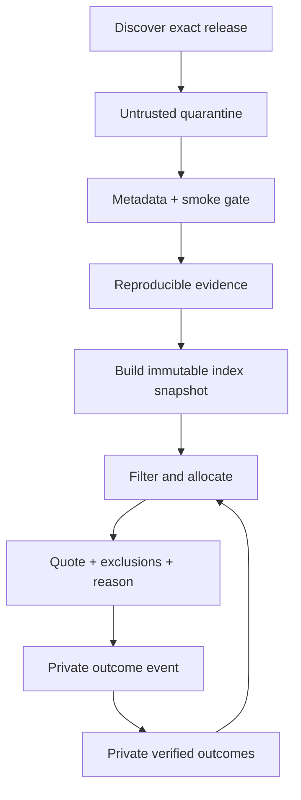
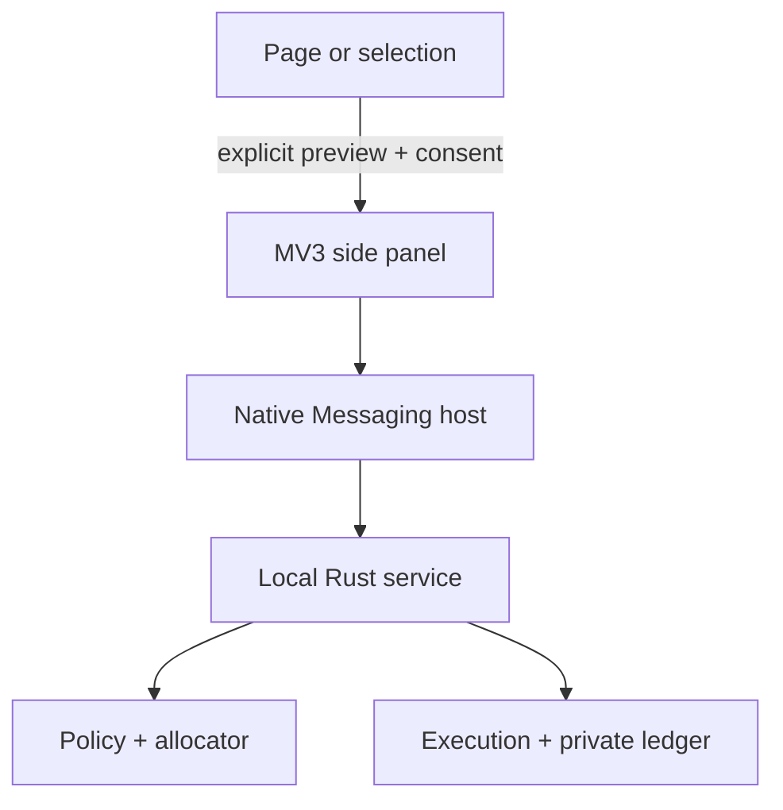

# Architecture

## Product boundary

OWI has two products that share schemas but not trust:

1. **Open Workforce Index** — public identities, offerings, prices, benchmark
   definitions, reproducible observations, provenance, and snapshots.
2. **Local Workforce Allocator** — private tasks, repository scopes, budgets,
   quotes, assignments, usage, verification, and outcomes.

One Rust executable can host both boundaries. In v0.1, the public side stores
catalog/evidence/snapshot records and the private side stores quote audits and
outcomes. Provider execution and the full usage/project ledger are planned for
v0.2. The database files, interfaces, and export paths remain separate so the
two products can later be deployed independently.

## System roles

These are the target execution roles, not services already implemented in
v0.1. The current engine performs constraint filtering and quoting; it does not
yet run a planner, reserve spend, call a provider, or execute a verifier.

| Role | May do | Must not do |
|---|---|---|
| Planner | Produce a typed task DAG with skills, risk, and acceptance criteria | Name models, grant tools, or authorize spend |
| Policy validator | Check DAG, privacy, permissions, overlap, and approval requirements | Use model persuasion as authority |
| Staffing engine | Map valid task requirements to eligible worker identities | Override hard constraints |
| Finance controller | Reserve and settle bounded cash/quota/time leases | Convert subscriptions to “free” without a user shadow price |
| Execution runtime | Run an assigned worker inside its lease | Expand repository, network, secret, or delegation scope |
| Verifier | Run deterministic checks and independent review | Let the same worker identity approve critical output |

The planner therefore never controls the three high-impact decisions: worker
identity, permission, or money.

## Data flow



Discovery metadata is not evidence of ability. Mutable provider aliases such as
`latest` resolve to an exact offering revision and never inherit the full
confidence of the previous target.

## Storage

### Version-controlled sources

Small curated facts and mappings live as reviewable JSON/Turtle plus import
code. Generated SQLite databases and large benchmark payloads are release
artifacts, not Git source. The v0.1 evidence record stores its source URI,
observation time, source/data license, artifact digest, metric, benchmark, and
adapter version. Separate retrieval/publication times and a typed protocol
manifest are v0.2 ingestion fields.

### Public SQLite index

Append-only releases, evidence, and snapshots. Offerings, aliases, and prices
are time-bounded revisions. A v0.1 snapshot records closed member lists,
ontology version, source revision, and a verified content digest. Estimator
version joins that manifest in v0.2. The public snapshot can be verified
without the private database.

### Private SQLite ledger

The v0.1 private database stores append-only quote audits and outcomes in a
different file with owner-only permissions. It does not yet contain provider
attempts, resource-usage postings, project allocations, or reports. Raw
prompts, credentials, patches, repository contents, and secrets have no
dedicated fields and are forbidden by the input contract. However, v0.1 still
accepts trusted-adapter free-form outcome metadata and repository scope, so it
does not claim a type-level secret-persistence guarantee. Those fields must be
restricted or redacted before execution is enabled. None of these private
values are part of the public schemas.

The planned v0.2 ledger adds attempts, usage, allocations, and private project
IDs that group registered Git repositories and worktrees. Remote URLs and local
paths will be represented by keyed fingerprints.

In that planned ledger, usage is event-based rather than one mutable cost on an
outcome. Provider totals and their project allocations are posted atomically.
Posted entries cannot be updated or deleted; refunds, invoice settlements, and
allocation changes append signed correction events. Every report names a
posting watermark and must satisfy, independently for every resource and
currency:

\[
\sum source\ totals = \sum project\ allocations
\]

Unknown attribution remains visible as `unallocated`. A non-zero
reconciliation delta invalidates the report.

### Knowledge graph

OWL/RDFS defines meaning, SKOS defines extensible application-domain, task,
artifact, skill, and acceptance concepts, PROV-O links evidence to sources, and
SHACL declares ingestion/export constraints. The graph acts like a scouting
system: a task class defines the position to fill, while each exact
`WorkerProfile` has evidence-backed abilities. It does not assign one overall
rating to a model.

The planned typed projection connects
`ApplicationDomain → TaskClass → ArtifactType` to required skills, tools, and a
versioned acceptance profile. Scoped estimates must trace to evidence with the
same applicability tuple. Oxigraph builds a disposable RDF read model from a
public snapshot for SPARQL and interoperability. A local-only view may join a
private structured task and quotes to that public snapshot; it is never a
public export. There is no SQLite/RDF dual write.

The v0.1 CLI syntax-parses the ontology and shapes; executing the SHACL rules
against a projected snapshot is a release gate planned with the projection
adapter. Syntax parsing alone is never reported as SHACL conformance.

## Estimation and routing

For worker \(w\) and task \(t\), v0.1 provides a transparent Beta estimator per
skill and produces a mean and conservative lower confidence bound (LCB). The
quote input carries the resulting task/skill estimates. Persisted scoped
ability estimates, capped public-prior strength, and repository/task-class
local calibration are v0.2 work.

Eligibility is lexicographic, not one unsafe weighted score:

1. Hard constraints: privacy, provider policy, context, modality/tools,
   permissions, availability, deadline, and budget dimensions.
2. Quality gate: \(LCB(P(pass\ on\ first\ attempt))\) meets the task threshold.
3. Objective: minimum expected accepted-result cost.

\[
C_{accepted} = C_{run} + C_{verify} + C_{quota-shadow}
+ (1 - P_{pass}) (C_{retry/escalate} + C_{failure})
\]

Cash uses integer micros. API cash, subscription quota, local GPU seconds,
tokens, and wall time remain separate budget dimensions unless the user defines
an explicit shadow price.

The v0.1 decision kernel is deterministic for the same serialized quote input
and records exclusions and the Pareto set, not merely the winner. Full replay
from persisted facts is a v0.2 gate: a decision manifest must also freeze the
canonical request, estimator, ontology, policy, public snapshot, and private
state versions plus any seed.

The person, not the planner, selects the optimization policy. In v0.1 this is
the transparent economy policy: minimize expected accepted-result cost after
quality and safety gates. Planned policies can prioritize quality or latency
inside a budget, or expose environmental trade-offs as a Pareto set. They do
not silently exchange privacy, quality, CO2e, water, and cash through one
opaque score.

### Evidence applicability

Benchmark evidence is scoped to what it measured. The v0.1 public record stores
the measured skill, benchmark, metric, exact release, and optional exact worker
plus provenance. It does **not** yet persist domain, task class, artifact,
acceptance profile, tool context, language/jurisdiction, or protocol as typed
applicability fields.

The v0.2 ontology contract adds those dimensions. A
`CapabilityEvidenceObservation` and `ScopedAbilityEstimate` must have the same
skill, application domain, task class, artifact type, and acceptance profile;
required tools must have been exercised by supporting evidence. The portable
local-only competency query uses exact matches. Future cross-scope transfer
would require a separately versioned, empirically justified mapping with an
uncertainty discount; absent evidence never becomes inferred capability.

The [AA-Omniscience paper](https://arxiv.org/abs/2511.13029) is a useful example:
its 6,000 questions cover 42 topics in six domains, and different research labs
lead different domains. It also finds that overall capability does not reliably
predict factual reliability. That supports domain-specific selection. But the
benchmark deliberately measures factual recall and calibrated abstention with
no tools or supplied context. Its Law result can inform a legal-factuality
skill; it cannot establish CAD artifact creation, geometry validity, or CAD
tool use. OWI preserves its accuracy, hallucination, abstention/attempt, cost,
and protocol evidence rather than treating its aggregate index as a universal
worker score.

### Application-aware task contracts

Routing is based on the work product, not on a global model rank or the
provider's description of a model. Think of a football team: the ontology
defines positions and measurable abilities, the knowledge graph keeps each
player's evidence history, and the allocator fills each position under the
person's budget and policy. An atomic task can be conversation, coding,
research, legal analysis, image creation, simulation, CAD, or a future class.

A planned application adapter turns an intent into a versioned domain, task
class, primary artifact type, required skills/tools, acceptance profile, risk,
and limits. The allocator first applies those requirements as hard eligibility
gates. It then compares only eligible exact workers using applicable evidence
and expected accepted-result cost. Composite work is split into atomic tasks so
different workers can fill different positions.

The v0.1 contract expresses application fit through `required_skills`,
`required_tools`, risk, privacy, and verification policy. Structured artifact
and acceptance-test manifests are a v0.2 extension; until then, adapters use
versioned skill/tool identifiers and include the named checks in the local task
summary. Model self-reports and generic conversation benchmarks do not grant a
skill or satisfy a tool requirement.

CAD is one example, not a privileged branch of the ontology. A mechanical CAD
task can require parametric-solid and
design-for-manufacture skills plus a CAD kernel, geometry validator, and STEP
exporter. A chat-only worker is ineligible even when it is cheaper and scores
highly on conversation. Eligible CAD workers are judged on reproducible CAD
evidence. Acceptance means that the generated artifact:

- parses in the specified CAD kernel and contains the required solid bodies;
- is closed and manifold, with no invalid or zero-volume geometry;
- satisfies named dimensions, tolerances, and parametric constraints;
- passes the applicable clearance, interference, and manufacturability checks;
- exports to the requested unit-aware format and survives a round-trip import.

All required checks must pass before an outcome is recorded as accepted. A
safety-relevant part additionally requires the task's independent-review or
human-approval policy; deterministic geometry checks alone cannot waive that
gate. See [`examples/cad-quote-request.json`](../examples/cad-quote-request.json)
for the executable routing fixture.

In v0.1, maker/checker quoting only reserves a distinct policy-authorized
checker ID and accepts a caller-supplied review-cost assumption. Checker
availability, clearance, review skill/evidence, context, and tariff are not yet
independently validated; maker/checker execution stays disabled until v0.2
represents the checker as a complete candidate plan.

## Browser advisor boundary (planned)

The Chromium client is a convenience surface, not a new trust domain. A
Manifest V3 side panel and context menu send typed requests through a registered
Native Messaging host to the local Rust service. The local service remains the
only component allowed to read the index/private ledger, resolve credentials,
validate policy, lease budgets, call providers, or post usage. Every client
field is revalidated.



The client presents three modes and does not blur their authority:

| Mode | Local-service operation | May contact a model? |
|---|---|---|
| `recommend` | Classify, quote, explain, and show alternatives | No |
| `run` | Approve a bounded lease, execute, stream events, settle receipt | Yes, after explicit approval |
| `project` | Read a reconciled private project report | No |

A versioned application adapter converts the user's requested deliverable and
consented context into a proposed task class, artifact type, required
skills/tools, acceptance checks, privacy, risk, and budget. It returns its
evidence and confidence for confirmation. A site name is only a hint: CAD work
requires CAD capabilities even when requested from a chat page, while a design
conversation does not automatically require a geometry tool. Classification
cannot grant permissions or lower a risk level.

Recommendations visibly separate `ready_now` workers from `setup_required`
catalog candidates and `excluded` workers. This lets OWI suggest a better model
the person has not configured without pretending it can be run. The explanation
includes the task-specific reason, hard exclusions, evidence/snapshot age,
expected accepted-result cost, uncertainty, and close Pareto alternatives.

The base extension has no `<all_urls>`, cookies, history, web-request inspection,
clipboard-read, or consumer-identity permission. Text typed in the panel needs
no page access. Selected text and page fields are read only after a user gesture
and field-level preview using temporary `activeTab` access; persistent host
permission is opt-in per application adapter. The extension keeps only
non-sensitive preferences and opaque local IDs. Raw prompt/output display,
local persistence, redaction, retention, and export are independent consent
choices; ledger metrics and content digests do not require retaining the raw
content.

Consumer-provider sessions are outside the boundary. OWI does not extract or
replay browser cookies, OAuth tokens, DOM tokens, or local storage. A provider
website can receive an explicit copy action and deep link, followed by explicit
result import; it is never scraped for output or billing. Direct `run` uses an
official API/local adapter and locally protected credentials that never enter
extension storage or page JavaScript.

Every direct execution starts with a quote naming the exact planner, maker,
checker/fallback workers; estimated cash/token/quota/tool use and environmental
coverage; project attribution; and a maximum task lease within hard daily,
weekly, project, and provider caps. A typed live timeline identifies each
planner, maker, checker, retry, fallback, tool, and verifier event, cumulative
usage, streamed output, and opaque artifact handles. Circuit breakers stop
before a spend, quota, output-token, retry, time, or policy limit is exceeded.
Increasing a lease requires a new approval. OWI never purchases credits,
enables top-ups, or uses gamified spending prompts.

The terminal event is an actual-versus-estimated receipt reconciled by project,
provider, worker/model, role, and attempt. Cash, subscriptions, tokens, quota,
tools, environmental coverage, and counterfactual savings remain separately
labeled. Chrome is the first packaging target; Edge and Brave use shared
WebExtension code only after browser-specific API and store-policy tests.
Native Messaging is preferred; an opt-in loopback fallback must bind only to
loopback and defend its paired, origin-bound protocol against cross-origin
requests and DNS rebinding.

The protocol, local advisor service, extension, and all three modes are planned,
not v0.1 functionality. Delivery starts read-only with `recommend`, adds
`project`, and enables `run` only after leases, receipts, provider adapters, and
tool/repository sandboxes pass security tests. See
[ADR 0008](adr/0008-browser-advisor-and-execution-boundary.md).

## Private project accounting (planned v0.2)

The execution runtime propagates a private attempt identifier into model and
tool adapters. The attempt links usage to a task node, exact worker, Git context,
and billing project. Separate attempt roles preserve the cost of makers,
retries, fallbacks, independent checkers, deterministic verification, tools,
planning, and routing. Failed attempts and optimizer overhead are not omitted.

Task-DAG nodes use either one billing project or a versioned, explicit
allocation policy. Shared integer amounts are divided deterministically and
still reconcile exactly. Allocation is never inferred from changed lines,
timestamps, or the current working directory.

Direct API cash and provider quota remain distinct. Tariff-derived charges are
marked provisional until settled against stronger billing evidence. A
subscription is posted once as organization overhead. An optional versioned
policy can reclassify that same fee to projects without creating more cash;
reports distinguish direct cash, allocated subscription overhead, quota, and
shadow values.

Project reports show reconciled usage and spend by worker/model, task, provider,
component, and attempt role. An optimizer comparison is a different section. A
baseline is frozen at decision time, and the difference is labeled
`counterfactual_estimate`, including method, uncertainty, coverage, and excluded
tasks. It is never presented as observed cash saved. A paired execution is an
`observed_cost_difference` because both alternatives were paid for.

See [ADR 0006](adr/0006-private-project-usage-accounting.md) for the private
ledger and counterfactual-accounting invariants.

## Environmental impact accounting (planned v0.2)

Energy, carbon, and water reuse the private usage allocations but never become
cash fields or a universal model score. Public environmental profiles are
immutable evidence tied to an exact offering, functional unit, measurement
boundary, lifecycle phase, source, and rational coefficient. A product-wide or
median-prompt disclosure cannot be copied onto a specific API model.

Project reports keep these views separate:

- IT/facility energy and operational/embodied/training lifecycle phases;
- location-based and market-based CO2e, which are alternative views and are
  not added together;
- water withdrawal and water consumption; and
- known estimates, partial coverage, scenarios, and structured unknowns.

Unknown impact is never represented as zero. Environmental profiles and source
provenance may enter the public index; project identity, usage calculations,
baselines, savings, and reports remain in the private trust domain. Estimated
avoided impact uses the same precommitted, equivalent-quality baseline as cost
savings, stays outside the actual inventory, and retains its counterfactual
label. See [ADR 0007](adr/0007-environmental-impact-accounting.md) and the
illustrative [`project-report.json`](../examples/project-report.json).

## Update lifecycle (planned)

The v0.2 ingestion workflow will be idempotent and content-addressed. New
entries move through:

```text
discovered → smoke_tested → benchmarked → eligible
```

A source observation is immutable. Relevance can become stale, so an estimator
may widen uncertainty or discount its transfer weight; it never edits the old
measurement. Changes to a model, harness, prompt/skill pack, tools, policy, or
opaque alias target create a new identity or revision.

## Execution boundary (planned)

Read-only workers may share a checkout. Every writing worker receives an
isolated worktree/container and a narrow path/action lease. Network egress,
secrets, push, pull request, merge, deploy, deletion, and budget expansion are
separate policy gates. Repository and tool output are treated as untrusted data
to limit prompt injection.
