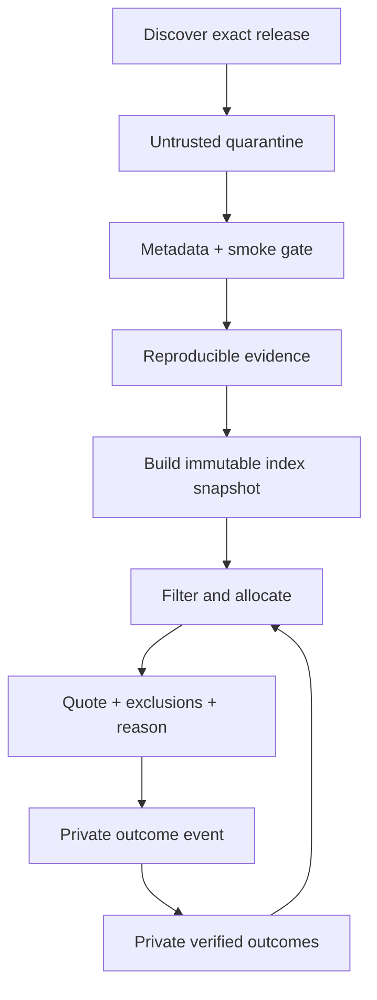

# Architecture

## Product boundary

OWI has two products that share schemas but not trust:

1. **Open Workforce Index** — public identities, offerings, prices, benchmark
   definitions, reproducible observations, provenance, and snapshots.
2. **Local Workforce Allocator** — private tasks, repository scopes, budgets,
   quotes, assignments, usage, verification, and outcomes.

One Rust executable can host both boundaries. In v0.1, the public side stores
catalog/evidence/snapshot records and the private side stores quote audits and
outcomes. Provider execution and the full usage/project ledger are planned for
v0.2. The database files, interfaces, and export paths remain separate so the
two products can later be deployed independently.

## System roles

These are the target execution roles, not services already implemented in
v0.1. The current engine performs constraint filtering and quoting; it does not
yet run a planner, reserve spend, call a provider, or execute a verifier.

| Role | May do | Must not do |
|---|---|---|
| Planner | Produce a typed task DAG with skills, risk, and acceptance criteria | Name models, grant tools, or authorize spend |
| Policy validator | Check DAG, privacy, permissions, overlap, and approval requirements | Use model persuasion as authority |
| Staffing engine | Map valid task requirements to eligible worker identities | Override hard constraints |
| Finance controller | Reserve and settle bounded cash/quota/time leases | Convert subscriptions to “free” without a user shadow price |
| Execution runtime | Run an assigned worker inside its lease | Expand repository, network, secret, or delegation scope |
| Verifier | Run deterministic checks and independent review | Let the same worker identity approve critical output |

The planner therefore never controls the three high-impact decisions: worker
identity, permission, or money.

## GitHub Manager boundary

The local graphical Manager is a read-only source adapter, not an execution
authority. It discovers repositories through a fixed GitHub REST origin and
stores bounded metadata, issues, pull requests, failed Actions runs, refresh
coverage, and import provenance in a separate private `github-manager.sqlite`.
The browser addresses only opaque server-discovered IDs and never supplies a
GitHub URL or credential.

The first connector is intentionally no-clone: it does not invoke Git, fetch
archives or repository contents, scan source code, install a webhook, or write
to GitHub. Refresh is manual and reports partial, stale, truncated, permission,
and rate-limit states. Import is a separate owner action that atomically creates
or reuses one unassigned local draft in `workflow.sqlite`. It does not call a
planner, allocator, provider, runner, verifier, or GitHub mutation endpoint.
Private GitHub provenance remains in private stores and imposes a
`confidential_content` privacy floor.

Public-owner mode needs no credential. Private access accepts only a
server-side token or owner-only token file; the token is never serialized to
the page, API response, log, or database. A future hosted boundary replaces
this local bridge with GitHub App OAuth plus selected-repository installation
access and short-lived tokens, without changing the source-item-to-draft
contract.

## Data flow



Discovery metadata is not evidence of ability. Mutable provider aliases such as
`latest` resolve to an exact offering revision and never inherit the full
confidence of the previous target.

## Storage

### Version-controlled sources

Small curated facts and mappings live as reviewable JSON/Turtle plus import
code. Generated SQLite databases and large benchmark payloads are release
artifacts, not Git source. The v0.1 evidence record stores its source URI,
observation time, source/data license, artifact digest, metric, benchmark, and
adapter version. Separate retrieval/publication times and a typed protocol
manifest are v0.2 ingestion fields.

### Public SQLite index

Append-only releases, evidence, and snapshots. Offerings, aliases, and prices
are time-bounded revisions. A v0.1 snapshot records closed member lists,
ontology version, source revision, and a verified content digest. Estimator
version joins that manifest in v0.2. The public snapshot can be verified
without the private database.

### Private SQLite ledger

The v0.1 private database stores append-only quote audits and outcomes in a
different file with owner-only permissions. It does not yet contain provider
attempts, resource-usage postings, project allocations, or reports. Raw
prompts, credentials, patches, repository contents, and secrets have no
dedicated fields and are forbidden by the input contract. However, v0.1 still
accepts trusted-adapter free-form outcome metadata and repository scope, so it
does not claim a type-level secret-persistence guarantee. Those fields must be
restricted or redacted before execution is enabled. None of these private
values are part of the public schemas.

The planned v0.2 ledger adds attempts, usage, allocations, and private project
IDs that group registered Git repositories and worktrees. Remote URLs and local
paths will be represented by keyed fingerprints.

In that planned ledger, usage is event-based rather than one mutable cost on an
outcome. Provider totals and their project allocations are posted atomically.
Posted entries cannot be updated or deleted; refunds, invoice settlements, and
allocation changes append signed correction events. Every report names a
posting watermark and must satisfy, independently for every resource and
currency:

\[
\sum source\ totals = \sum project\ allocations
\]

Unknown attribution remains visible as `unallocated`. A non-zero
reconciliation delta invalidates the report.

### Knowledge graph

OWL/RDFS defines meaning, SKOS defines extensible application-domain, task,
artifact, skill, and acceptance concepts, PROV-O links evidence to sources, and
SHACL declares ingestion/export constraints. The graph acts like a scouting
system: a task class defines the position to fill, while each exact
`WorkerProfile` has evidence-backed abilities. It does not assign one overall
rating to a model.

The planned typed projection connects
`ApplicationDomain → TaskClass → ArtifactType` to required skills, tools, and a
versioned acceptance profile. Scoped estimates must trace to evidence with the
same applicability tuple. Oxigraph builds a disposable RDF read model from a
public snapshot for SPARQL and interoperability. A local-only view may join a
private structured task and quotes to that public snapshot; it is never a
public export. There is no SQLite/RDF dual write.

The v0.1 CLI syntax-parses the ontology and shapes; executing the SHACL rules
against a projected snapshot is a release gate planned with the projection
adapter. Syntax parsing alone is never reported as SHACL conformance.

## Estimation and routing

For worker \(w\) and task \(t\), `workforce-allocator` derives a Beta posterior
per skill from stored evidence and produces a mean and a conservative lower
credible bound (LCB).

The bound is the exact `tail_probability` quantile of the posterior, computed
from the regularized incomplete beta function. It is deliberately not the
normal approximation `mean - z·sqrt(var)`: that form is *anti-conservative*
when observations are few and the success rate is high, which is the state of
every newly discovered worker. At `Beta(6, 1)` it reports a 95% floor of 0.654
against a true 0.607, and the error only becomes negligible past roughly a
hundred observations. `BetaPosterior::normal_approximation_lower_bound` retains
the old form so the divergence stays measurable in tests, but it is not a gate.

Evidence enters the posterior under three rules:

1. **Scope is exact.** A public observation applies only when it measured this
   skill *and* either this exact worker or the model release behind it. Evidence
   from another skill is not discounted — it is absent.
2. **Public evidence is capped.** All public observations for one skill together
   contribute at most `max_public_prior_weight` pseudo-observations, scaled to
   preserve the reported success ratio. A benchmark quoting ten thousand samples
   cannot swamp six verified local outcomes. This cap is the difference between
   an index and a leaderboard.
3. **Scores are never invented.** A benchmark result is usable as a pass rate
   only if it already lies in \([0, 1]\). An Elo or a raw count is counted as
   `unusable_observation_count` and reported, not normalized by guesswork.

A task requiring several skills must clear all of them, so its mean is the
product of the skill means, its bound the product of the skill bounds, and its
evidence count the *minimum* across skills — a worker is only as measured as
its least-measured requirement.

Repository- and task-class-specific calibration remains later work.

Eligibility then adds a second, independent test: an estimate must be backed by
at least `minimum_evidence_count` applicable observations. A confidence bound
alone cannot distinguish a well-measured worker from an adapter that asserted a
number, so the two are checked separately and rejected separately.

Eligibility is lexicographic, not one unsafe weighted score:

1. Hard constraints: privacy, provider policy, context, modality/tools,
   permissions, availability, deadline, and budget dimensions.
2. Quality gate: \(LCB(P(pass\ on\ first\ attempt))\) meets the task threshold.
3. Objective: minimum expected accepted-result cost.

\[
C_{accepted} = C_{run} + C_{verify} + C_{quota-shadow}
+ C_{retry/escalate} \sum_{k=1}^{A-1} (1 - P_{pass})^{k}
\]

where \(A\) is `policy.max_attempts`. At the default \(A = 2\) this is the
familiar \((1 - P_{pass}) \cdot C_{retry}\); the general form matters because
assuming a single retry always succeeds systematically flatters cheap
unreliable workers, which is the exact error this objective exists to avoid.

\(P_{pass}\) is the mean by default. The gate is always conservative, but an
expectation is ordinarily taken at the mean, so the objective's choice is
separate and explicit: `policy.failure_probability_basis` selects `mean` or
`lower_bound`. The distinction is not cosmetic — under `mean`, `Beta(2, 1)` and
`Beta(60, 30)` share a mean and therefore rank identically, even though one is
a guess and the other is measured. `lower_bound` charges a wide posterior for
its own uncertainty.

Cash uses integer micros. API cash, subscription quota, local GPU seconds,
tokens, and wall time remain separate budget dimensions unless the user defines
an explicit shadow price.

The v0.1 decision kernel is deterministic for the same serialized quote input
and records exclusions and the Pareto set, not merely the winner. Full replay
from persisted facts is a v0.2 gate: a decision manifest must also freeze the
canonical request, estimator, ontology, policy, public snapshot, and private
state versions plus any seed.

The person, not the planner, selects the optimization policy. In v0.1 this is
the transparent economy policy: minimize expected accepted-result cost after
quality and safety gates. Planned policies can prioritize quality or latency
inside a budget, or expose environmental trade-offs as a Pareto set. They do
not silently exchange privacy, quality, CO2e, water, and cash through one
opaque score.

### Evidence applicability

Benchmark evidence is scoped to what it measured. The v0.1 public record stores
the measured skill, benchmark, metric, exact release, and optional exact worker
plus provenance. It does **not** yet persist domain, task class, artifact,
acceptance profile, tool context, language/jurisdiction, or protocol as typed
applicability fields.

The v0.2 ontology contract adds those dimensions. A
`CapabilityEvidenceObservation` and `ScopedAbilityEstimate` must have the same
skill, application domain, task class, artifact type, and acceptance profile;
required tools must have been exercised by supporting evidence. The portable
local-only competency query uses exact matches. Future cross-scope transfer
would require a separately versioned, empirically justified mapping with an
uncertainty discount; absent evidence never becomes inferred capability.

The [AA-Omniscience paper](https://arxiv.org/abs/2511.13029) is a useful example:
its 6,000 questions cover 42 topics in six domains, and different research labs
lead different domains. It also finds that overall capability does not reliably
predict factual reliability. That supports domain-specific selection. But the
benchmark deliberately measures factual recall and calibrated abstention with
no tools or supplied context. Its Law result can inform a legal-factuality
skill; it cannot establish CAD artifact creation, geometry validity, or CAD
tool use. OWI preserves its accuracy, hallucination, abstention/attempt, cost,
and protocol evidence rather than treating its aggregate index as a universal
worker score.

### Application-aware task contracts

Routing is based on the work product, not on a global model rank or the
provider's description of a model. Think of a football team: the ontology
defines positions and measurable abilities, the knowledge graph keeps each
player's evidence history, and the allocator fills each position under the
person's budget and policy. An atomic task can be conversation, coding,
research, legal analysis, image creation, simulation, CAD, or a future class.

A planned application adapter turns an intent into a versioned domain, task
class, primary artifact type, required skills/tools, acceptance profile, risk,
and limits. The allocator first applies those requirements as hard eligibility
gates. It then compares only eligible exact workers using applicable evidence
and expected accepted-result cost. Composite work is split into atomic tasks so
different workers can fill different positions.

The v0.1 contract expresses application fit through `required_skills`,
`required_tools`, risk, privacy, and verification policy. Structured artifact
and acceptance-test manifests are a v0.2 extension; until then, adapters use
versioned skill/tool identifiers and include the named checks in the local task
summary. Model self-reports and generic conversation benchmarks do not grant a
skill or satisfy a tool requirement.

CAD is one example, not a privileged branch of the ontology. A mechanical CAD
task can require parametric-solid and
design-for-manufacture skills plus a CAD kernel, geometry validator, and STEP
exporter. A chat-only worker is ineligible even when it is cheaper and scores
highly on conversation. Eligible CAD workers are judged on reproducible CAD
evidence. Acceptance means that the generated artifact:

- parses in the specified CAD kernel and contains the required solid bodies;
- is closed and manifold, with no invalid or zero-volume geometry;
- satisfies named dimensions, tolerances, and parametric constraints;
- passes the applicable clearance, interference, and manufacturability checks;
- exports to the requested unit-aware format and survives a round-trip import.

All required checks must pass before an outcome is recorded as accepted. A
safety-relevant part additionally requires the task's independent-review or
human-approval policy; deterministic geometry checks alone cannot waive that
gate. See [`examples/cad-quote-request.json`](../examples/cad-quote-request.json)
for the executable routing fixture.

In v0.1, maker/checker quoting only reserves a distinct policy-authorized
checker ID and accepts a caller-supplied review-cost assumption. Checker
availability, clearance, review skill/evidence, context, and tariff are not yet
independently validated; maker/checker execution stays disabled until v0.2
represents the checker as a complete candidate plan.

## Deferred product boundaries

The browser advisor, private Git-project cost accounting, and environmental
impact accounting each had a full section here and a numbered ADR. They now
live in [`docs/future/`](future/), because specifying a Chrome extension's
DNS-rebinding defence for a product with no users is design debt, not
architecture.

The load-bearing invariants survive the move and are restated in
[`docs/future/README.md`](future/README.md): usage postings are append-only
events that reconcile exactly to their allocations, unknown environmental
impact is `unknown` and never zero, optimizer savings stay labelled
`counterfactual_estimate`, and a convenience client is never a new trust
domain.

## Update lifecycle (planned)

The v0.2 ingestion workflow will be idempotent and content-addressed. New
entries move through:

```text
discovered → smoke_tested → benchmarked → eligible
```

A source observation is immutable. Relevance can become stale, so an estimator
may widen uncertainty or discount its transfer weight; it never edits the old
measurement. Changes to a model, harness, prompt/skill pack, tools, policy, or
opaque alias target create a new identity or revision.

## Execution boundary (planned)

Read-only workers may share a checkout. Every writing worker receives an
isolated worktree/container and a narrow path/action lease. Network egress,
secrets, push, pull request, merge, deploy, deletion, and budget expansion are
separate policy gates. Repository and tool output are treated as untrusted data
to limit prompt injection.
