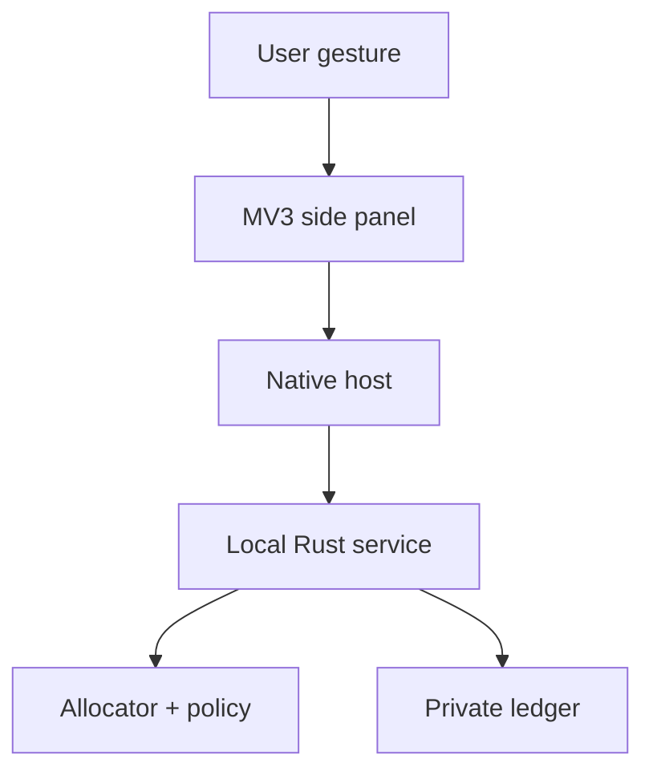

# ADR 0008: Keep the browser advisor outside the local policy and secret boundary

- Status: Accepted
- Date: 2026-08-07

## Context

Model choice is useful at the point where a person describes work, not only in
a terminal. A Chromium extension can make OWI available beside many browser
applications, but the page surface alone does not determine the task. A prompt
for conversation, a repository change, and a parametric CAD artifact require
different skills, tools, acceptance checks, and risk policies. The most capable
general chat model is not automatically eligible for each application.

A browser also holds sensitive page content, cookies, consumer-provider
sessions, and potentially confidential prompts. Granting an extension access to
every page or letting it extract browser sessions would turn a local advisor
into a high-value credential and surveillance target. The extension must not
become the allocator, the credential store, or an authority to spend money.

Users also need to understand what the system is doing before and during a run.
A single final price hides planner, maker, checker, retry, fallback, and tool
activity. Without a maximum-spend lease, circuit breakers, and an
actual-versus-estimated receipt, an optimizer could create the very cost risk it
is meant to control.

## Decision

### The browser exposes three explicit modes

The planned client has three modes with different authority:

| Mode | Result | Authority |
|---|---|---|
| `recommend` | Ranked workers, exclusions, alternatives, and setup guidance | Read-only; it cannot contact a model |
| `run` | Approved direct-API execution with a live event stream and final receipt | Requires a runnable worker, local policy approval, and a bounded spend lease |
| `project` | Private Git-project usage, cost, impact coverage, and estimated optimization benefit | Read-only reporting over the private local ledger |

The default is `recommend`. Opening the side panel, selecting text, or asking
for a recommendation never starts a provider request. Changing to `run` is a
separate user action and every run receives a preflight approval.

### Application detection produces a reviewable typed contract

The extension submits a minimal `TaskIntent` to the local advisor. It can
include the user's own description, desired artifact type, an explicit page or
application adapter ID, and context the user chose to share. A versioned
application adapter proposes a typed task contract containing:

- task class and requested artifact or response type;
- required skills, modalities, tools, and permissions;
- deterministic acceptance checks where applicable;
- privacy, latency, quality, and budget requirements; and
- risk and maker/checker or human-approval policy.

The proposal includes the detection evidence, adapter version, and confidence.
The person can correct it before quoting. Low-confidence classification asks
for the work product instead of silently assuming one. Page origin, title, and
model self-description are hints, not proof of ability. Detection never grants
a tool, reduces risk, or authorizes spend.

For example, a recognized CAD surface can propose a STEP artifact, a CAD kernel,
geometry validation, and parametric-solid skills. A chat-only worker is then
excluded by hard requirements. A request to discuss design concepts may remain
a conversation task even on the same site. The requested deliverable, not the
brand of the current web application, controls the contract.

### Recommendations separate runnable workers from possible workers

The advisor does not collapse catalog eligibility and local availability into
one list. It presents:

1. **Ready now** — exact workers configured locally and allowed by current
   provider, privacy, budget, and tool policy.
2. **Setup required** — otherwise eligible public-index workers that may be
   better, cheaper, or lower impact, but lack a local provider account, API
   credential, harness, tool, or explicit permission.
3. **Unavailable or excluded** — candidates blocked by access, geography,
   policy, application fit, quality, evidence freshness, or another hard
   constraint.

A setup-required candidate is never represented as runnable. Its projected
quality, price, and environmental coverage retain their public-evidence
uncertainty and do not inherit private calibration from a different worker.
The UI shows the selected worker, close alternatives, Pareto trade-offs, every
exclusion, evidence/snapshot age, estimated accepted-result cost, and why the
choice changes when the task or application changes. “Best” always means best
for this typed contract and policy, not best model globally.

### The extension is an untrusted client of a local Rust service

The Manifest V3 extension contains only the side-panel/context-menu UI, a
service worker, typed protocol bindings, and optional application adapters. The
Rust local service owns the allocator, policy, index, private ledger,
credentials, provider adapters, execution, and reporting. Client requests are
untrusted input; the service revalidates the task, policy, quote version,
worker identity, approval, and lease before acting.

The preferred transport is Chrome Native Messaging through a small registered
OWI host. The host allows only the published extension IDs, uses a versioned
length-bounded message schema, rejects unknown fields and message kinds, and
passes opaque artifact handles rather than arbitrary local paths. Streaming
uses bounded event chunks so large model output is not placed in one native
message.

An optional loopback transport is a development or explicitly enabled fallback,
not the default. It binds only to loopback, uses one-time pairing and a
short-lived capability token, validates the exact extension origin, rejects
ambient cookies and cross-origin mutation requests, limits body size and rate,
and protects against DNS rebinding. It never listens on a LAN interface.

### Browser access is least-privilege and consented

The base manifest does not request `<all_urls>`, cookie access, web-request
inspection, clipboard-read access, browsing history, or consumer identity. Its
baseline permissions are limited to the extension UI and connector needs, such
as `sidePanel`, `contextMenus`, `storage`, and `nativeMessaging`. `activeTab`
and `scripting` are used only for an explicit invocation when selected page
content must be read. Persistent host access is an optional permission granted
per application adapter and can be revoked.

The side panel can accept text typed directly by the user on any page without
page access. “Recommend selected text” is an explicit context-menu gesture and
shares only the displayed selection preview. “Use this page” is a different
action with a field-level preview of the title, origin, selection, or extracted
adapter fields. The extension never collects an entire page in the background.
Page content, selected text, and model output remain untrusted data and cannot
expand tool permissions, spending, or repository scope.

Extension storage contains non-sensitive preferences and opaque local IDs only.
Raw prompts and outputs are transient by default. Displaying them in the panel,
persisting them locally, redacting them, and exporting them are separate
consents. If persistence is enabled for a project, it is local, encrypted where
the platform supports it, scope-limited, and covered by a retention policy.
The accounting ledger can store metrics and content digests without storing raw
content. Secret-like values are redacted before display or persistence.

### Provider websites and direct APIs are distinct execution paths

OWI never extracts cookies, OAuth tokens, local storage, DOM session tokens, or
other credentials from consumer AI websites. It does not replay a person's
Claude, ChatGPT, Gemini, or other browser session and does not scrape a provider
page to claim an execution result.

For a provider website, the extension may offer an explicit copy action and a
deep link to the provider application. Prompt text is not embedded in a URL.
The person pastes or submits it and explicitly imports/pastes the result back
into OWI if they want it verified or accounted. These actions are recorded as
user-mediated with incomplete provider telemetry unless stronger billing data
is imported.

Automated `run` mode uses an official provider API or a local model adapter. API
keys and other credentials are configured in the Rust service and stored in a
local OS credential facility or an equivalently protected local store; they
never enter extension storage or page JavaScript. The provider adapter receives
only the credential and task data required for the approved execution.

### Every direct run is visible, bounded, and receipted

Before execution the side panel shows a quote and approval record with:

- exact planner, maker, checker/fallback workers and provider offerings;
- estimated direct cash, token/quota use, latency, retries, tool charges, and
  environmental estimates or structured unknowns;
- project attribution and the applicable daily, weekly, project, provider, and
  task caps; and
- an explicit maximum cash/quota/output-token/attempt lease for this run.

The service streams a typed timeline after approval. Each event names its
attempt role (`planner`, `maker`, `checker`, `retry`, `fallback`, `tool`, or
`verifier`), exact worker when applicable, state, cumulative resource usage,
and artifact reference. Direct API text may be streamed through the local
service; larger or non-text artifacts remain local and are represented by
opaque references. Provider-web results are never scraped and enter the
timeline only through an explicit user import.

Hard circuit breakers stop or pause before exceeding the approved task lease,
retry/attempt limit, output-token limit, or daily, weekly, project, and provider
caps. A checker or retry cannot silently expand the lease. Increasing a cap
requires a new human approval that shows the incurred amount and increment.
OWI never buys credits, tops up an account, upgrades a subscription, or turns
on provider auto-recharge. The UI reports currency and quota plainly and does
not use streaks, urgency, confetti, or other gamified credit-spending patterns.

At completion, failure, cancellation, or circuit-break the service emits an
actual-versus-estimated receipt. It reconciles usage by project, provider,
model/worker, role, and attempt; separates cash, subscription allocation,
tokens, quota, and tools; and reports environmental values with their evidence
boundary, uncertainty, and coverage. Estimated optimizer benefit stays a
separately labeled counterfactual with the frozen baseline. It is not mixed
with observed charges.

### Chromium support is incremental

Chrome Manifest V3 is the first client target. Shared WebExtension code and a
small browser-capability adapter keep Edge and Brave viable, but each browser
package is tested against its actual API support and store policy; Chromium
heritage is not treated as proof of parity. A fallback panel or extension page
is used where the Chrome Side Panel API is unavailable.

Delivery is phased:

1. define and test the typed advisor/stream protocol and local read-only
   `recommend` service;
2. ship a recommendation-only Chrome side panel and context-menu flow with no
   provider credentials;
3. add private `project` reports and opt-in application adapters;
4. enable direct-API `run` only after provider adapters, receipts, leases,
   circuit breakers, and repository/tool sandboxes pass security tests; and
5. test and package Edge and Brave variants after capability review.

All browser client, local-service, commands, transports, and interfaces in this
ADR are planned work. They are not implemented by the v0.1 decision-kernel
fixture.

## Threat model

The first release must test at least these boundaries:

- a hostile page fabricating task context, changing selected text after the
  preview, or sending messages to a content script;
- prompt injection in shared page text, provider output, or imported artifacts;
- a compromised or spoofed native/loopback peer requesting secrets, files,
  repository writes, or larger spend;
- stale quote replay, duplicate approval, event reordering, oversized messages,
  and extension service-worker restart;
- cross-origin loopback requests, DNS rebinding, capability-token theft, and
  unauthorized browser extension IDs;
- a provider response that exceeds the approved token, cash, retry, time, or
  project/provider budget; and
- accidental disclosure through notifications, extension storage, logs,
  clipboard history, artifact names, raw prompt persistence, or report export.

The local policy engine is authoritative in every case. Page content and model
output cannot approve their own execution, change a project, grant a tool,
select a secret, or increase a cap.

## Consequences

The browser can make recommendations broadly available without broadly reading
the browser. Recommendation-only use works before a person configures any API
credential, and unconfigured alternatives remain discoverable without being
misrepresented as executable. Direct execution takes more engineering because
the service must stream typed events, enforce several concurrent caps, and
produce a reconciled receipt.

Provider consumer subscriptions cannot be automated by borrowing their browser
sessions. Those providers use a visible copy/deep-link/import workflow until an
official API adapter is configured. This limitation preserves account security
and makes telemetry coverage honest.

## Invariants

1. `recommend` never invokes a provider, and no run occurs without an explicit
   preflight approval and bounded lease.
2. The extension cannot authorize workers, tools, repository scope, secrets, or
   spend; the local Rust service revalidates every request.
3. No default `<all_urls>` permission, background page capture, consumer-session
   extraction, or credential storage in the extension is permitted.
4. Ready, setup-required, and excluded workers are visibly distinct.
5. Application detection is versioned, reviewable, and subordinate to the
   user's requested work product and hard task contract.
6. Every direct run exposes a role/attempt timeline, circuit breakers, and an
   actual-versus-estimated receipt.
7. No automatic credit purchase, top-up, subscription upgrade, or gamified
   spending interface is allowed.
8. Raw prompt/output display, local persistence, redaction, retention, and
   export remain separate consent decisions.

## References

- [Chrome Side Panel API](https://developer.chrome.com/docs/extensions/reference/api/sidePanel)
- [Chrome extension permissions](https://developer.chrome.com/docs/extensions/develop/concepts/declare-permissions)
- [Chrome Native Messaging](https://developer.chrome.com/docs/extensions/develop/concepts/native-messaging)
- [Chrome content scripts](https://developer.chrome.com/docs/extensions/develop/concepts/content-scripts)
- [Porting Chrome extensions to Microsoft Edge](https://learn.microsoft.com/en-us/microsoft-edge/extensions/developer-guide/port-chrome-extension)
