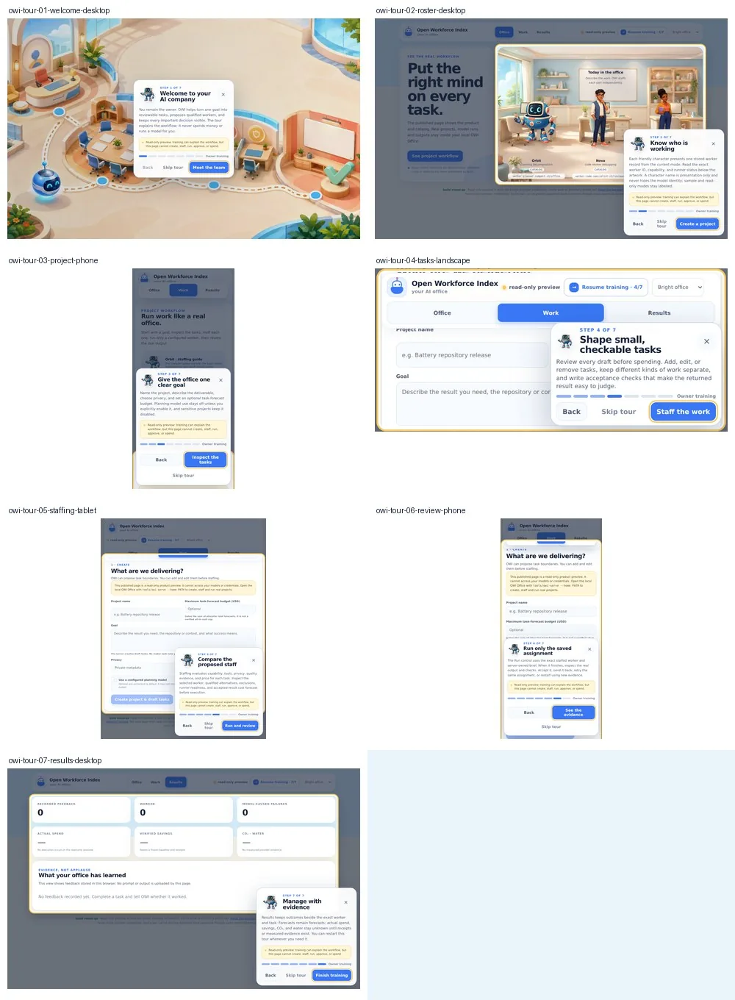

# Training tour · seven-pass design record

This record documents seven real review passes over the rendered OWI Office.
The screenshot sheet uses a deterministic, read-only roster fixture. It is
visual evidence only: no model was called, no project was created, and none of
its names or counts are presented as user evidence.

## 1 · Workflow truth

The first draft mentioned a future GitHub Manager. That was removed from this
tour because the current application cannot yet connect a GitHub App or import
work items. The shipped seven chapters cover only working surfaces: Office,
project creation, task planning, staffing, exact-worker run/review, and Results.
Every chapter is descriptive; advancing the tour sends no mutating request.

## 2 · Scene composition

The opening was changed from a generic tooltip to a full training-map scene
with four readable office stations and Orbit's route. The bitmap contains no
copy, metrics, prices, or controls. Desktop uses a full-bleed scene; phone
portrait contains the 16:9 map so its first and last stations are not cropped.
The image was inspected at its 1280×720 runtime resolution.

## 3 · Mobile ergonomics

The app gained a 48 px mobile bottom navigation, safe-area padding on all four
edges, a touch-first coach sheet, and a compact landscape layout. Chromium
checks at 390×844, 430×932, 844×390, and 320×568 found no horizontal overflow.
The primary tour action remained inside the coach viewport at 320×568.

## 4 · Interaction and accessibility

The controller now provides first-run start, pause, resume, skip, replay,
completion, Back/Next, arrow keys, Escape, focus trapping/restoration, announced
progress, missing-target fallback, resize/scroll tracking, and reduced motion.
A browser interaction test completed all seven chapters, replayed the tour,
then paused it with Escape. Browser preferences store only `{version, status,
step}`.

## 5 · Runtime-mode honesty

The coach distinguishes a published read-only preview, an unconfigured local
office, explicitly labelled sample mode, and a configured live office. Stored
worker records are never described as live runners unless an exact worker-ID
runner exists. Missing spend, savings, CO₂, and water remain unknown.

## 6 · Performance and reusable graphics

The renderer now resolves stable asset IDs through the v2 manifest rather than
hard-coded file paths. Five WebP runtime assets total 211,204 bytes. A rendered,
self-contained page with all art, tour CSS, tour data, and JavaScript is about
479 KiB and has no remote dependency or unresolved placeholder. Asset,
provenance, scene, and tour schemas validate in development mode.

## 7 · Adversarial visual regression

Headless Chromium rendered each chapter across desktop, tablet, phone portrait,
and phone landscape. Automated bounds checks proved the coach stayed inside the
viewport, the primary action stayed at least 44×44 px, the page did not overflow
horizontally, and the coach painted above highlighted content. This pass found
and closed three defects: a target stacking above the coach, a spotlight that
did not follow smooth scrolling, and a small-phone primary action that could
begin outside the visible coach scrollport.

Development validation is green. Release validation intentionally remains
closed while generated-art rights are marked `pending`; this draft must not be
merged as a released art pack until a maintainer records rights approval.
